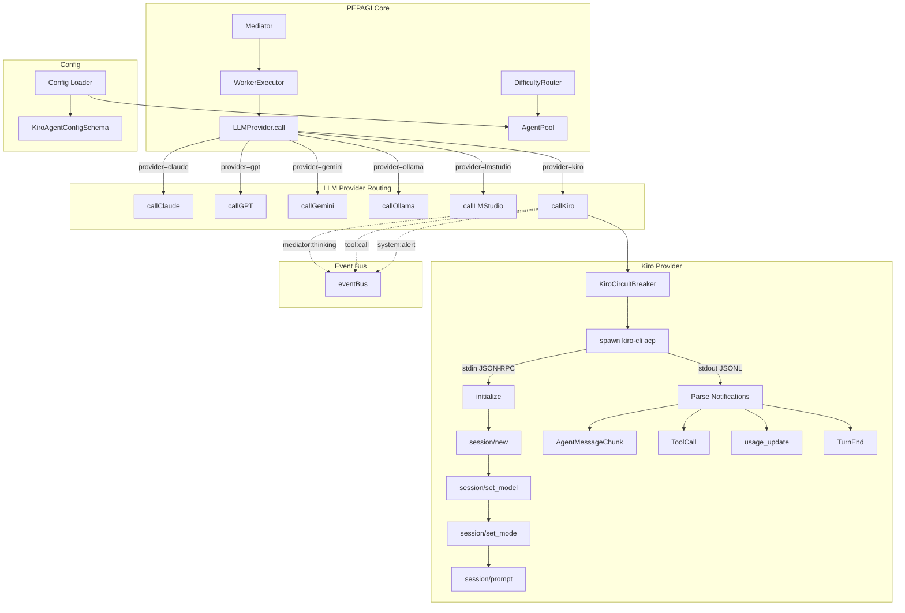
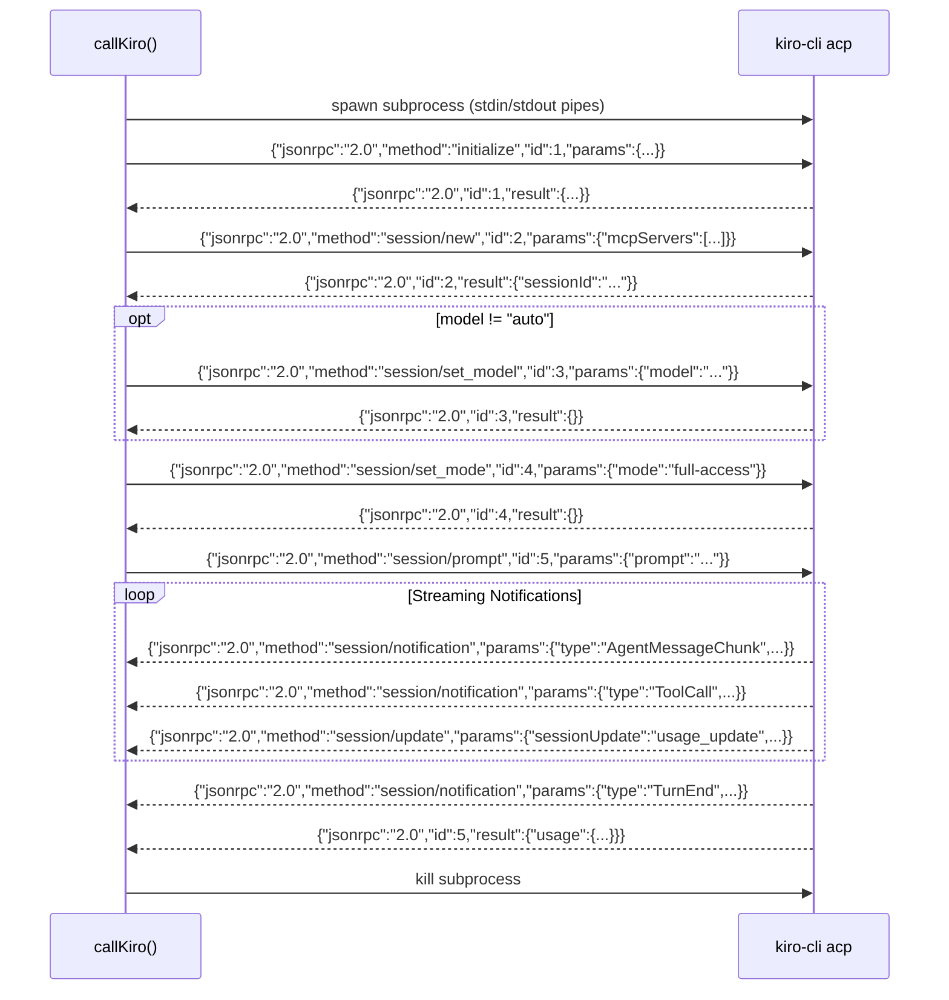

# Design Document: Kiro CLI Support as LLM Provider

## Overview

This design adds Kiro CLI as a new LLM provider to PEPAGI, following the same patterns used by the existing Claude, GPT, Gemini, Ollama, and LM Studio providers. Kiro CLI communicates via the Agent Client Protocol (ACP) — a JSON-RPC 2.0 protocol over stdin/stdout — rather than REST APIs or SDK calls.

The core integration point is a new `callKiro()` function in `src/agents/llm-provider.ts` that:
1. Spawns `kiro-cli acp` as a subprocess
2. Performs the ACP handshake (initialize → session/new → session/set_model → session/set_mode → session/prompt)
3. Parses streaming session notifications (AgentMessageChunk, ToolCall, TurnEnd, usage_update)
4. Returns a standard `LLMResponse`

Kiro is unique among providers because it manages its own authentication and model parameters internally. The PEPAGI config uses a dedicated schema (no apiKey, temperature, maxOutputTokens) and treats Kiro as a zero-cost local provider for difficulty routing purposes.

### Key Design Decisions

1. **One subprocess per call**: Each `callKiro()` invocation spawns a fresh `kiro-cli acp` process. This avoids session state leakage between tasks and simplifies cleanup. The ACP protocol is designed for this pattern.

2. **Dedicated circuit breaker**: A separate `KiroCircuitBreaker` instance (not shared with Claude Code) tracks Kiro failures independently, using the same threshold/window/reset pattern as `ClaudeCodeCircuitBreaker`.

3. **Dedicated config schema**: Kiro's config omits `apiKey`, `temperature`, `maxOutputTokens`, and `maxAgenticTurns` since Kiro CLI handles these internally. Only `enabled`, `model`, `agent`, `timeout`, and `forwardMcpServers` are exposed.

4. **Session mode mapping**: `agenticMode: true` maps to ACP `"full-access"` mode; `agenticMode: false` maps to `"read-only"` mode. This prevents unnecessary tool usage on simple text-only calls.

5. **Graceful usage fallback**: If the ACP response includes `usage` data (per the ACP usage_update RFD), use it. Otherwise, fall back to character-based estimation (chars/4) with zero cost.

## Architecture

### Component Diagram



### ACP Message Flow



## Components and Interfaces

### 1. Type Extension (`src/core/types.ts`)

```typescript
// Add "kiro" to the AgentProvider union
export type AgentProvider = "claude" | "gpt" | "gemini" | "ollama" | "lmstudio" | "kiro";
```

The `LLMCallOptions.provider` field already uses `AgentProvider`, so it automatically accepts `"kiro"`.

### 2. Configuration Schema (`src/config/loader.ts`)

```typescript
/** Dedicated Kiro config — no apiKey/temperature/maxOutputTokens/maxAgenticTurns */
const KiroAgentConfigSchema = z.object({
  enabled: z.boolean().default(false),
  model: z.string().default("auto"),
  agent: z.string().default(""),
  timeout: z.number().default(120),
  forwardMcpServers: z.array(z.object({
    name: z.string(),
    command: z.string(),
    args: z.array(z.string()).default([]),
    env: z.array(z.object({
      name: z.string(),
      value: z.string(),
    })).default([]),
  })).default([]),
});
```

Added as an optional field in the agents config object:
```typescript
agents: z.object({
  claude: AgentConfigSchema.extend({ ... }),
  gpt: AgentConfigSchema.extend({ ... }),
  gemini: AgentConfigSchema.extend({ ... }),
  ollama: AgentConfigSchema.extend({ ... }).optional(),
  kiro: KiroAgentConfigSchema.optional(),
})
```

Environment variable overlay:
```typescript
if (process.env.KIRO_CLI_ENABLED === "true") {
  agents.kiro = { ...(agents.kiro ?? {}), enabled: true };
  log("KIRO_CLI_ENABLED detected — Kiro agent enabled");
}
```

### 3. Kiro Circuit Breaker (`src/agents/llm-provider.ts`)

A dedicated instance following the exact same pattern as `ClaudeCodeCircuitBreaker`:

```typescript
class KiroCircuitBreaker {
  private failures: Date[] = [];
  private state: "closed" | "open" | "half-open" = "closed";
  private lastFailureTime: number | null = null;

  private readonly THRESHOLD = 10;
  private readonly RESET_TIMEOUT = 300_000; // 5 min
  private readonly WINDOW = 600_000;        // 10 min

  async call<T>(fn: () => Promise<T>): Promise<T>;
  getState(): "closed" | "open" | "half-open";
  getRecentFailureCount(windowMs?: number): number;
  forceReset(): void;
}

export const kiroCircuitBreaker = new KiroCircuitBreaker();
```

State transition events emitted via `eventBus`:
- closed → open: `system:alert` level `"warn"` — "Kiro CLI unavailable, circuit breaker OPEN"
- open → half-open: `system:alert` level `"warn"` — "Kiro CLI recovery probe"
- half-open → closed: `system:alert` level `"warn"` — "Kiro CLI recovered, circuit breaker CLOSED"

### 4. ACP JSON-RPC Helpers (`src/agents/llm-provider.ts`)

Internal helpers for building and parsing JSON-RPC 2.0 messages:

```typescript
/** Build a JSON-RPC 2.0 request */
function acpRequest(id: number, method: string, params: Record<string, unknown>): string;

/** Parse a JSON-RPC 2.0 response/notification from a line of stdout */
interface ACPMessage {
  jsonrpc: "2.0";
  id?: number;
  method?: string;
  params?: Record<string, unknown>;
  result?: Record<string, unknown>;
  error?: { code: number; message: string; data?: unknown };
}
```

### 5. Core Provider Function: `callKiro()` (`src/agents/llm-provider.ts`)

```typescript
/**
 * Call Kiro CLI via ACP (Agent Client Protocol) over stdin/stdout.
 * Spawns `kiro-cli acp` subprocess, performs ACP handshake, sends prompt,
 * parses streaming notifications, and returns standard LLMResponse.
 *
 * @param opts - Standard LLMCallOptions with provider="kiro"
 * @param kiroConfig - Kiro-specific config (model, agent, timeout, forwardMcpServers)
 * @returns LLMResponse with accumulated content, tool calls, usage, and latency
 */
async function callKiro(opts: LLMCallOptions, kiroConfig: KiroAgentConfig): Promise<LLMResponse>;
```

Internal flow:
1. Circuit breaker guard (`kiroCircuitBreaker.call(...)`)
2. Spawn `kiro-cli acp` (with optional `--agent <name>`)
3. Set up line-buffered JSONL parser on stdout
4. Send `initialize` request (10s timeout)
5. Send `session/new` request (with `mcpServers` from config)
6. Conditionally send `session/set_model` (if model != "auto")
7. Send `session/set_mode` ("full-access" or "read-only")
8. Send `session/prompt` with constructed prompt
9. Parse notifications: accumulate text, emit events, track usage
10. On TurnEnd or prompt response: assemble LLMResponse
11. Kill subprocess, clean up listeners

### 6. Health Check (`src/agents/llm-provider.ts`)

```typescript
/**
 * Check if Kiro CLI is installed and responsive.
 * Spawns `kiro-cli acp`, sends initialize, expects response within 5s.
 * @returns true if Kiro CLI is available
 */
export async function checkKiroHealth(): Promise<boolean>;
```

### 7. LLMProvider Routing (`src/agents/llm-provider.ts`)

Add `"kiro"` case to the `LLMProvider.call()` switch:

```typescript
case "kiro":
  return callKiro(opts, kiroConfig);
```

The `callKiro` call is already wrapped by `withRetry` since `LLMProvider.call()` wraps the entire switch in `withRetry`.

### 8. Agent Pool Integration (`src/agents/agent-pool.ts`)

Add Kiro to `agentDefs`:
```typescript
{ provider: "kiro", displayName: "Kiro CLI (ACP)", defaultModel: "auto" }
```

Kiro uses the dedicated config schema (no apiKey check). Availability is based solely on `enabled` flag, similar to Ollama/LM Studio. Health check via `checkKiroHealth()` in `probeLocalModels()`.

### 9. Difficulty Router Integration (`src/core/difficulty-router.ts`)

- Add `"kiro"` to the fallback chain in `getFallbackChain()`
- Treat Kiro as zero-cost (like Ollama) when computing performance scores
- Include Kiro in the `preferOllama`-style local provider preference for trivial/simple tasks

### 10. Pricing Entry (`src/agents/pricing.ts`)

```typescript
// Kiro CLI — managed provider, cost tracked via ACP usage_update
{ model: "auto", provider: "kiro", inputCostPer1M: 0, outputCostPer1M: 0, contextWindow: 200_000, supportsTools: true },
```

Zero cost in the pricing table since actual cost comes from ACP `usage_update` notifications at runtime.

## Data Models

### ACP JSON-RPC Message Types

```typescript
/** JSON-RPC 2.0 base message */
interface JsonRpcMessage {
  jsonrpc: "2.0";
}

/** JSON-RPC 2.0 request (sent to kiro-cli) */
interface JsonRpcRequest extends JsonRpcMessage {
  id: number;
  method: string;
  params?: Record<string, unknown>;
}

/** JSON-RPC 2.0 response (received from kiro-cli) */
interface JsonRpcResponse extends JsonRpcMessage {
  id: number;
  result?: unknown;
  error?: { code: number; message: string; data?: unknown };
}

/** JSON-RPC 2.0 notification (received from kiro-cli, no id) */
interface JsonRpcNotification extends JsonRpcMessage {
  method: string;
  params?: Record<string, unknown>;
}
```

### ACP Session Notification Types

```typescript
/** AgentMessageChunk — streaming text content */
interface ACPAgentMessageChunk {
  type: "AgentMessageChunk";
  text: string;
}

/** ToolCall — agent invoked a tool */
interface ACPToolCall {
  type: "ToolCall";
  name: string;
  input: Record<string, unknown>;
  id?: string;
}

/** ToolCallUpdate — tool execution progress */
interface ACPToolCallUpdate {
  type: "ToolCallUpdate";
  toolCallId: string;
  content: string;
}

/** TurnEnd — session turn completed */
interface ACPTurnEnd {
  type: "TurnEnd";
}
```

### ACP Usage Update (from RFD)

```typescript
/** session/update notification with usage data */
interface ACPUsageUpdate {
  sessionUpdate: "usage_update";
  contextWindow?: {
    used: number;
    size: number;
  };
  cost?: {
    amount: number;
    currency: string;
  };
}

/** Usage field in PromptResponse */
interface ACPPromptUsage {
  total_tokens?: number;
  input_tokens?: number;
  output_tokens?: number;
  thought_tokens?: number;
  cached_read_tokens?: number;
  cached_write_tokens?: number;
}
```

### Kiro Agent Configuration

```typescript
/** Kiro-specific config (subset of PepagiConfig.agents.kiro) */
interface KiroAgentConfig {
  enabled: boolean;
  model: string;           // "auto" | specific model identifier
  agent: string;           // custom agent name, "" = none
  timeout: number;         // seconds
  forwardMcpServers: Array<{
    name: string;
    command: string;
    args: string[];
    env: Array<{ name: string; value: string }>;
  }>;
}
```


## Correctness Properties

*A property is a characteristic or behavior that should hold true across all valid executions of a system — essentially, a formal statement about what the system should do. Properties serve as the bridge between human-readable specifications and machine-verifiable correctness guarantees.*

### Property 1: ACP Protocol Message Ordering

*For any* `callKiro` invocation with any valid `LLMCallOptions` and `KiroAgentConfig`, the sequence of JSON-RPC requests written to the subprocess stdin SHALL always follow the order: `initialize` → `session/new` → (optionally `session/set_model` if model ≠ "auto") → `session/set_mode` → `session/prompt`. No request may be sent out of this order, and no request may be skipped (except `session/set_model` when model is "auto").

**Validates: Requirements 2.2, 3.1, 3.2, 3.5**

### Property 2: Subprocess Cleanup Invariant

*For any* `callKiro` invocation — whether it succeeds, throws an error, or times out — the spawned `kiro-cli acp` subprocess SHALL be terminated and all stdio listeners removed after the call completes. No zombie processes or leaked file descriptors shall remain.

**Validates: Requirements 2.5**

### Property 3: Prompt Construction Completeness

*For any* `LLMCallOptions` with a non-empty `systemPrompt` and any array of messages (each with non-empty `content`), the prompt string sent in the `session/prompt` request SHALL contain the full `systemPrompt` text and the full `content` of every message in the messages array.

**Validates: Requirements 3.3**

### Property 4: JSONL Notification Parsing Round-Trip

*For any* valid JSON-RPC 2.0 message object, serializing it to a newline-delimited JSON string and feeding it through the stdout line parser SHALL produce a parsed object equivalent to the original message.

**Validates: Requirements 4.1**

### Property 5: AgentMessageChunk Accumulation

*For any* sequence of `AgentMessageChunk` notifications followed by a `TurnEnd` notification, the `LLMResponse.content` field SHALL equal the concatenation of all `text` fields from the `AgentMessageChunk` notifications in order.

**Validates: Requirements 4.2, 4.4, 5.1**

### Property 6: ToolCall Notification Mapping

*For any* sequence of `ToolCall` notifications received during a session, the `LLMResponse.toolCalls` array SHALL contain one entry per `ToolCall` notification, with matching `name` and `input` fields.

**Validates: Requirements 4.3, 5.2**

### Property 7: Token Usage Estimation Fallback

*For any* prompt string and response string where the ACP response does not include a `usage` field, `LLMResponse.usage.inputTokens` SHALL equal `Math.ceil(promptChars / 4)` and `LLMResponse.usage.outputTokens` SHALL equal `Math.ceil(responseChars / 4)`, and `LLMResponse.cost` SHALL be 0.

**Validates: Requirements 5.3, 5.4, 14.4**

### Property 8: Kiro Config Schema Validation Round-Trip

*For any* valid `KiroAgentConfig` object (with `enabled` as boolean, `model` as string, `agent` as string, `timeout` as positive number, and `forwardMcpServers` as array of valid MCP server configs), serializing to JSON and parsing through the `KiroAgentConfigSchema` SHALL produce an equivalent object.

**Validates: Requirements 7.1**

### Property 9: Agent Pool Availability

*For any* `PepagiConfig` where `agents.kiro.enabled` is `true`, the `AgentPool.getAvailableAgents()` result SHALL include an `AgentProfile` with `provider === "kiro"`. Conversely, when `agents.kiro.enabled` is `false`, `"kiro"` SHALL NOT appear in the available agents.

**Validates: Requirements 7.6**

### Property 10: Difficulty Router Zero-Cost Treatment

*For any* routing decision where Kiro is available in the agent pool, the Kiro provider's cost contribution to the performance score SHALL be 0 (equivalent to Ollama's local provider treatment), and Kiro SHALL be included as a candidate agent.

**Validates: Requirements 8.1, 8.2**

### Property 11: Circuit Breaker State Machine

*For any* sequence of `callKiro` outcomes (success or failure), the `KiroCircuitBreaker` SHALL transition states correctly: after `THRESHOLD` failures within `WINDOW` ms, state transitions from "closed" to "open"; after `RESET_TIMEOUT` ms in "open", state transitions to "half-open"; a success in "half-open" transitions to "closed"; a failure in "half-open" transitions back to "open". Each state transition SHALL emit a `system:alert` event on the Event_Bus with level `"warn"`.

**Validates: Requirements 9.2, 9.3, 16.1, 16.2, 16.3**

### Property 12: Spawn Arguments from Agent Config

*For any* `KiroAgentConfig` with a non-empty `agent` string, the subprocess SHALL be spawned with arguments `["acp", "--agent", agent]`. *For any* config with an empty or absent `agent` string, the subprocess SHALL be spawned with arguments `["acp"]` only.

**Validates: Requirements 12.1, 12.2**

### Property 13: Session Mode Mapping

*For any* `LLMCallOptions` where `agenticMode` is `true`, the `session/set_mode` request SHALL contain `mode: "full-access"`. *For any* `LLMCallOptions` where `agenticMode` is `false` or absent, the `session/set_mode` request SHALL contain `mode: "read-only"`.

**Validates: Requirements 13.1, 13.2**

### Property 14: Usage and Cost Extraction from ACP Data

*For any* ACP session that produces a `PromptResponse` with a `usage` field containing `input_tokens` and `output_tokens`, the `LLMResponse.usage` SHALL use those exact values (not the character-based estimation). *For any* `usage_update` notification containing a `cost` object, the `LLMResponse.cost` SHALL equal `cost.amount`.

**Validates: Requirements 14.1, 14.2, 14.3**

### Property 15: MCP Server Forwarding

*For any* `KiroAgentConfig` with a non-empty `forwardMcpServers` array, the `session/new` request SHALL include all configured MCP servers in the `mcpServers` parameter, each conforming to the ACP stdio transport schema (name, command, args, env). *For any* config with an empty or absent `forwardMcpServers`, the `session/new` request SHALL include an empty `mcpServers` array.

**Validates: Requirements 15.1, 15.2, 15.3, 15.4**

## Error Handling

### Subprocess Errors

| Error Condition | Behavior | Retryable |
|---|---|---|
| `kiro-cli` not found on PATH | `LLMProviderError("kiro", 1, "Kiro CLI not installed...")` | No |
| `initialize` timeout (10s) | Kill subprocess, `LLMProviderError("kiro", 504, "ACP initialize timeout")` | Yes |
| `session/new` JSON-RPC error | `LLMProviderError("kiro", code, errorMessage)` | Depends on code |
| `session/prompt` JSON-RPC error | `LLMProviderError("kiro", code, errorMessage)` | Depends on code |
| Subprocess exits with non-zero code | `LLMProviderError("kiro", exitCode, stderr)` | Yes |
| Subprocess spawn error (ENOENT, EACCES) | `LLMProviderError("kiro", 1, spawnError)` | No |

### Timeout and Abort

| Condition | Behavior |
|---|---|
| `LLMCallOptions.timeoutMs` elapses | Kill subprocess (SIGKILL), throw `LLMProviderError("kiro", 504, "timeout")` |
| `AbortController.signal` triggered | Send `session/cancel`, SIGTERM, escalate to SIGKILL after 5s |
| Default timeout (from `kiroConfig.timeout`) | Applied when `LLMCallOptions.timeoutMs` is not set |

### Circuit Breaker

| State | Behavior on `callKiro()` |
|---|---|
| closed | Execute normally, record failures |
| open | Throw non-retryable `LLMProviderError("kiro", 503, "Circuit breaker OPEN")` immediately |
| half-open | Allow one probe call; success → closed, failure → open |

### Flood Limiter

The existing per-provider `checkFloodLimit` / `recordFloodFailure` mechanism applies to `"kiro"` automatically via the `withRetry` wrapper. After 15 failures in 60s, a 120s forced cooldown is triggered.

### Malformed ACP Messages

Lines from stdout that are not valid JSON are silently buffered (same pattern as Claude CLI JSONL parsing). Incomplete JSON lines are accumulated in the line buffer until a complete line is received.

## Testing Strategy

Testing follows a layered approach. Layers 1 and 2 are built as part of this feature. Layers 3 and 4 are documented for future implementation.

### Layer 1: ACP Subprocess Simulator (BUILD NOW)

A standalone TypeScript script (`src/agents/__tests__/acp-simulator.ts`) that behaves like `kiro-cli acp` — a real executable that reads JSON-RPC 2.0 from stdin and writes ACP responses to stdout. Tests spawn this simulator as a real subprocess instead of mocking `child_process.spawn`, giving real stdio pipes, real line buffering, real process lifecycle, and real signal handling.

The simulator is scenario-driven via an environment variable `ACP_SCENARIO`:

| Scenario | Behavior |
|---|---|
| `happy-path` | Responds to initialize, session/new, set_model, set_mode, session/prompt. Emits 3 AgentMessageChunk notifications, 1 ToolCall, 1 usage_update, then TurnEnd. Returns PromptResponse with usage field. |
| `happy-no-usage` | Same as happy-path but omits usage field from PromptResponse and does not emit usage_update. Tests fallback estimation. |
| `error-on-session-new` | Returns JSON-RPC error response to session/new request. |
| `error-on-prompt` | Returns JSON-RPC error response to session/prompt request. |
| `hang-on-initialize` | Accepts connection but never responds to initialize. Tests 10s timeout. |
| `crash-mid-stream` | Emits 2 AgentMessageChunk notifications then exits with code 1. Tests subprocess crash recovery. |
| `malformed-json` | Emits valid initialize response, then sends a line of garbage text before valid session notifications. Tests JSONL parser resilience. |
| `slow-chunks` | Emits AgentMessageChunk notifications with 500ms delays between them. Tests streaming patience and abort handling. |
| `partial-lines` | Splits JSON-RPC messages across multiple write() calls (mid-line splits). Tests line buffer reassembly. |
| `sigterm-graceful` | On SIGTERM, sends session/cancel acknowledgment then exits 0. Tests graceful shutdown. |
| `sigterm-ignore` | Ignores SIGTERM (tests SIGKILL escalation after 5s). |

The simulator also reads `ACP_MODEL`, `ACP_AGENT`, and `ACP_MCP_SERVERS` env vars to validate that callKiro passes the correct spawn arguments and session/new parameters.

Location: `src/agents/__tests__/acp-simulator.ts`
Compiled to: `dist/agents/__tests__/acp-simulator.js` (spawned via `node`)

### Layer 2: Integration Smoke Test against Real Kiro CLI (BUILD NOW)

A single integration test gated behind the `KIRO_CLI_AVAILABLE=true` environment variable. When enabled, it spawns the actual `kiro-cli acp` binary, sends a trivial prompt in read-only mode, and verifies:
- Initialize response is received
- Session is created successfully
- A TurnEnd notification is received
- The returned LLMResponse has non-empty content

This test does NOT run in CI by default — it requires Kiro CLI installed and authenticated on the developer's machine. It serves as the "does it actually work end-to-end" sanity check.

Location: `src/agents/__tests__/kiro-provider.test.ts` (in a `describe.skipIf(!process.env.KIRO_CLI_AVAILABLE)` block)

### Layer 3: Contract Tests against ACP Spec (FUTURE)

Contract tests that verify our JSON-RPC messages conform to the ACP protocol schema — correct method names, correct param shapes, correct id sequencing. These would run against the simulator but validate the wire format independently of the provider logic. If the ACP spec evolves, these tests catch drift early.

### Layer 4: Chaos / Fault Injection via Simulator (FUTURE)

Extend the simulator with randomized fault injection: delayed responses, partial JSON lines split across chunks, unexpected process exit mid-stream, stderr noise, SIGTERM during prompt. Combined with property-based testing (fast-check), this generates random fault sequences and verifies the provider always cleans up, never hangs, and always throws a proper LLMProviderError. This is where the simulator + PBT combination becomes powerful for finding edge cases that scripted scenarios miss.

### Property-Based Testing

Property-based tests use `fast-check` (already available in the project via vitest). Each property test runs a minimum of 100 iterations with randomized inputs. Tests spawn the ACP simulator (Layer 1) as a real subprocess where subprocess interaction is being tested, and use direct function calls for pure logic properties.

Each property test is tagged with a comment referencing the design property:
```
// Feature: kiro-cli-support, Property N: <property title>
```

Properties to implement as PBT:

| Property | Test Focus | Generator Strategy |
|---|---|---|
| P1: ACP Protocol Message Ordering | Capture stdin writes via simulator, verify sequence | Random LLMCallOptions + KiroAgentConfig (model: "auto" vs specific) |
| P3: Prompt Construction | Verify prompt contains all parts via simulator stdin capture | Random systemPrompt + random message arrays |
| P4: JSONL Parsing Round-Trip | Serialize → parse → compare | Random JSON-RPC message objects |
| P5: AgentMessageChunk Accumulation | Feed chunks via simulator, verify concatenation | Random arrays of text chunks |
| P6: ToolCall Mapping | Feed ToolCall notifications via simulator, verify array | Random ToolCall sequences |
| P7: Token Estimation Fallback | Verify chars/4 calculation | Random prompt/response strings |
| P8: Config Schema Round-Trip | Serialize → parse → compare | Random KiroAgentConfig objects |
| P11: Circuit Breaker State Machine | Sequence of success/failure, verify states | Random sequences of outcomes |
| P12: Spawn Args from Config | Verify args array via simulator env capture | Random agent name strings (empty and non-empty) |
| P13: Session Mode Mapping | Verify mode string via simulator stdin capture | Random boolean agenticMode values |
| P15: MCP Server Forwarding | Verify session/new params via simulator stdin capture | Random MCP server config arrays |

### Unit Tests

Unit tests cover specific examples, edge cases, and integration points. Tests that involve subprocess interaction use the ACP simulator (Layer 1) instead of mocking spawn:

| Test | Type | Approach |
|---|---|---|
| `kiro-cli` not found | Edge case | Mock spawn ENOENT (no simulator needed) |
| Initialize timeout | Edge case | Simulator scenario: `hang-on-initialize` |
| Session/new error response | Edge case | Simulator scenario: `error-on-session-new` |
| Session/prompt error response | Edge case | Simulator scenario: `error-on-prompt` |
| Subprocess crash mid-stream | Edge case | Simulator scenario: `crash-mid-stream` |
| Malformed JSON in stdout | Edge case | Simulator scenario: `malformed-json` |
| Partial line buffering | Edge case | Simulator scenario: `partial-lines` |
| Abort signal handling | Example | Simulator scenario: `sigterm-graceful` + `sigterm-ignore` |
| Timeout handling | Edge case | Simulator scenario: `slow-chunks` with short timeout |
| Health check — healthy | Example | Simulator scenario: `happy-path` (initialize only) |
| Health check — unhealthy | Edge case | Mock spawn ENOENT |
| LLMProvider routing | Example | Simulator scenario: `happy-path` |
| withRetry wrapping | Example | Simulator scenario: `error-on-prompt` (retryable) |
| Config schema rejects apiKey | Example | Direct Zod schema test (no subprocess) |
| Config model values | Example | Direct Zod schema test (no subprocess) |
| Config timeout default | Example | Direct Zod schema test (no subprocess) |
| KIRO_CLI_ENABLED env var | Example | Direct config loader test (no subprocess) |
| Agent pool availability | Example | Direct agent pool test (no subprocess) |
| Circuit breaker separation | Example | Direct instance comparison (no subprocess) |
| Usage data from ACP response | Example | Simulator scenario: `happy-path` (with usage) |
| Usage fallback estimation | Example | Simulator scenario: `happy-no-usage` |
| Context window tracking | Example | Simulator scenario: `happy-path` (usage_update event) |
| Cost from usage_update | Example | Simulator scenario: `happy-path` (cost in usage_update) |

### Test File Locations

Tests are colocated per project convention:
- `src/agents/__tests__/acp-simulator.ts` — ACP subprocess simulator (Layer 1)
- `src/agents/__tests__/kiro-provider.test.ts` — all callKiro, circuit breaker, health check, config, and integration tests

### Mocking Strategy

The ACP simulator replaces most spawn mocking. Remaining mocks:
- Mock `child_process.spawn` only for ENOENT/EACCES spawn failure tests (simulator can't simulate "binary not found")
- `vi.useFakeTimers()` for circuit breaker timing tests (threshold windows, reset timeouts)
- Mock `eventBus.emit` to verify event emission (spy, not replace)
- Direct Zod schema and config loader tests need no mocking
