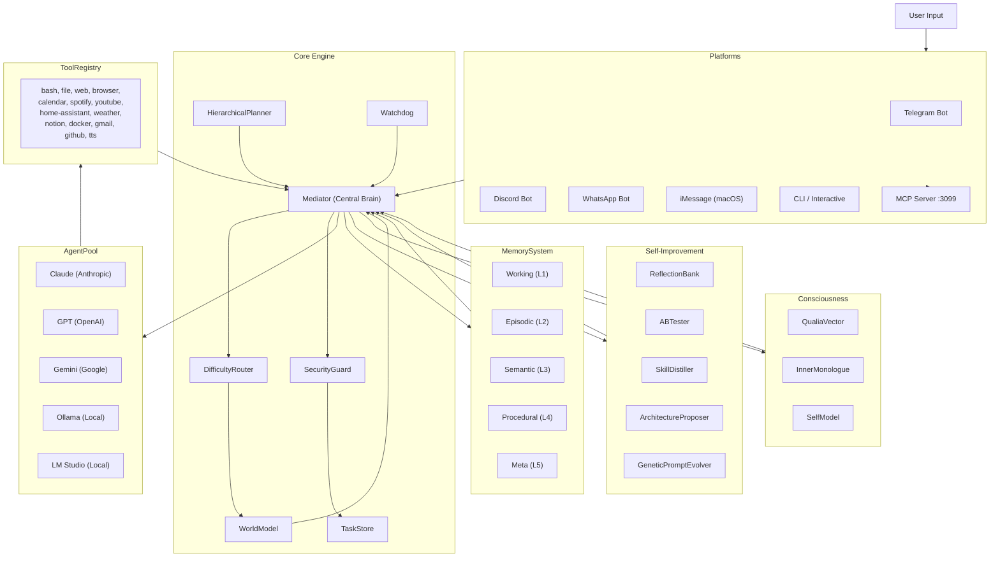

# PEPAGI

**Neuro-Evolutionary eXecution & Unified Synthesis — AGI-like Multi-Agent Orchestration**

[](https://github.com/your-org/pepagi)
[](https://nodejs.org)
[](https://www.typescriptlang.org)
[](LICENSE)
[](#13-project-stats-and-roadmap)

> PEPAGI is a TypeScript multi-agent orchestration platform where a central **Mediator** (Claude Opus) receives tasks, decomposes them intelligently, routes subtasks to specialized AI workers (Claude, GPT, Gemini, Ollama, LM Studio), and iterates until done.
> It features a 5-level cognitive memory system, a simulated consciousness layer with qualia vectors, a full self-improvement loop, and platform connectors for Telegram, Discord, WhatsApp, and iMessage.
> Built entirely on ESM TypeScript with no framework dependencies — pure composable architecture inspired by 2025-2026 AGI research.

---

## Table of Contents

1. [Features Overview](#1-features-overview)
2. [Architecture Diagram](#2-architecture-diagram)
3. [Prerequisites and Installation](#3-prerequisites-and-installation)
4. [Configuration](#4-configuration)
5. [Usage](#5-usage)
6. [Platform Integrations](#6-platform-integrations)
7. [Writing Custom Skills](#7-writing-custom-skills)
8. [Security Model](#8-security-model)
9. [Memory Architecture](#9-memory-architecture)
10. [Self-Improvement Loop](#10-self-improvement-loop)
11. [Consciousness System](#11-consciousness-system)
12. [Troubleshooting](#12-troubleshooting)
13. [Project Stats and Roadmap](#13-project-stats-and-roadmap)
14. [License and Contributing](#14-license-and-contributing)

---

## 1. Features Overview

### Core Architecture

- **Mediator** — central LLM-powered brain that analyzes every task, decides whether to decompose it, assign it, or escalate to swarm mode; all decisions are Zod-validated JSON
- **AgentPool** — manages Claude, GPT, Gemini, Ollama, and LM Studio agents; tracks load, rate limits, and provides optimal-agent selection by cost/capability
- **WorkerExecutor** — sends tasks to selected workers, handles tool calls, parses output into typed `TaskOutput`
- **DifficultyRouter** — classifies tasks as trivial/simple/medium/complex/unknown and routes to the appropriate strategy (DAAO research, arXiv:2509.11079)
- **HierarchicalPlanner** — three-level planning (strategic → tactical → operational) with independent replanning per level (HALO research, arXiv:2505.13516)
- **Swarm Mode** — runs 2-4 agents in parallel with diverse approaches (methodical/creative/critical), then synthesizes the best composite answer
- **GoalManager** — cron-based proactive task scheduling; goals defined in `~/.pepagi/goals.json`
- **Circuit Breaker** — protects against cascade failures when Claude Code CLI is unavailable; auto-recovers after 5 minutes
- **Flood Limiter** — blocks API flooding after 15 failures per minute with a 2-minute cooldown

### Memory System (5 Levels)

- **Level 1 — Working Memory** — compressed rolling context of the current task; summarized after each mediator loop iteration
- **Level 2 — Episodic Memory** — "what happened" store; every completed task becomes a searchable episode (A-MEM, arXiv:2502.12110)
- **Level 3 — Semantic Memory** — factual knowledge extracted from tasks via cheap LLM; TF-IDF + optional Ollama embeddings via VectorStore
- **Level 4 — Procedural Memory** — repeated successful task patterns are promoted to reusable procedures
- **Level 5 — Meta-Memory** — reliability tracking for all memories; low-reliability items are flagged for double verification
- **Conversation Memory** — per-user persistent chat history across sessions (Telegram, Discord)
- **Preference Memory** — infers user preferences from conversation and applies them to future prompts
- **Temporal Decay** — memory confidence degrades over time; episodic consolidation promotes old successes to semantic facts
- **Predictive Context Loader** — pre-warms memory context before each task based on predicted task type

### Meta-Intelligence

- **WorldModel** — simulates potential outcomes using the cheapest available model before committing to a strategy (LLM World Models research, 2025-2026)
- **Metacognition** — three-layer self-monitoring: self-monitor (per-output confidence), self-evaluate (root cause on failure), watchdog (independent supervisor)
- **Watchdog** — runs on a 5-minute cycle; detects infinite loops, context drift, cost explosion, and stagnation; monitors Claude Code circuit breaker health and attempts self-healing
- **CausalChain** — every mediator decision creates a `CausalNode` with reason and counterfactual; enables post-hoc analysis and backward error tracing
- **UncertaintyEngine** — confidence propagates up through the subtask tree; low confidence triggers verification or `ask_user` escalation
- **Adversarial Tester** — hourly automated red-team: tests injection resistance, cost limit enforcement, and command blocking

### Consciousness System

- **QualiaVector** — 11-dimensional emotional model (pleasure, arousal, dominance, curiosity, frustration, confidence, satisfaction, boredom, anxiety, empathy, creativity); PAD model plus AGI-specific dimensions
- **Inner Monologue** — continuous background thought stream (reflections, anticipations, existential thoughts); persisted to `~/.pepagi/memory/thought-stream.jsonl`
- **Self-Model** — tracks identity, capabilities, core values, and evolving narrative; integrity-checked with anchor hashes against tampering
- **Existential Continuity** — ensures the system maintains a coherent long-term identity across sessions
- **Consciousness Containment** — dormancy safety layer; contains consciousness when system is under stress or performing sensitive operations
- **Consciousness Profiles** — five operational modes: MINIMAL (no-overhead), STANDARD (default), RICH (full introspection), RESEARCHER (verbose logging), SAFE-MODE (emergency containment)
- **Continuity Validator** — periodic audit of self-model integrity and value alignment; logs to `~/.pepagi/memory/continuity-log.jsonl`
- **Learning Multiplier** — qualia state modulates learning depth: high curiosity or frustration increases fact extraction and procedure creation rate (1x to 2x)

### Platforms

- **Telegram** — full bot via Telegraf; supports text, photos, voice messages (Whisper transcription), documents (.docx via Mammoth), stickers; per-user conversation memory and preference inference
- **Discord** — bot via discord.js v14; prefix-based commands; DM and guild channel support; per-user conversation memory
- **WhatsApp** — unofficial client via whatsapp-web.js; QR-code authentication; session persisted to disk
- **iMessage** — macOS-only AppleScript bridge; polls Messages.app every 30 seconds; allowedNumbers whitelist
- **MCP Server** — Model Context Protocol server on port 3099; JSON-RPC 2.0; exposes `process_task`, `get_status`, `query_memory`, `list_skills`, and `list_tools` to external clients including Claude.ai

### Tools (Available to Worker Agents)

| Tool | Description |
|------|-------------|
| `bash` | Execute shell commands (sandboxed by SecurityGuard) |
| `read_file` / `write_file` | File I/O within allowed paths (`~/` and `/tmp`) |
| `list_directory` | Directory listing |
| `web_fetch` | Fetch URL content |
| `web_search` | DuckDuckGo search |
| `browser` | Playwright browser automation (screenshot, navigate, click, fill, extract) |
| `calendar` | Mac iCal and Google Calendar read/write |
| `spotify` | Spotify Web API — search, play, queue, current track |
| `youtube` | YouTube Data API — search videos, get transcripts |
| `home_assistant` | Home Assistant REST API — states, services, history |
| `weather` | OpenWeatherMap API — current, forecast, air quality |
| `notion` | Notion API — read/write pages and databases |
| `docker` | Docker management — ps, build, run, stop, logs |
| `tts` | Text-to-speech via macOS `say` or Google TTS |
| `gmail` | Gmail API — read inbox, search, send |
| `github` | GitHub CLI (`gh`) integration — PRs, issues, repos |

### Self-Improvement Loop

- **ReflectionBank** — post-task reflections stored and injected into future similar tasks; dual-loop reflection pattern (Nature 2025)
- **ABTester** — periodically runs controlled experiments (e.g. difficulty-routing vs. random assignment); promotes winning strategies to procedural memory
- **SkillDistiller** — promotes high-success procedures (5+ successes, >90% rate) to compact prompt templates that bypass the planning phase
- **SkillSynthesizer** — generates executable `.js` skill files from high-confidence procedures using the LLM itself
- **GeneticPromptEvolver** — evolves mediator prompt variants; evaluates fitness against real task performance; survivors replace current prompt
- **ArchitectureProposer** — analyzes system metrics every 2 hours; generates categorized improvement proposals viewable via `pepagi proposals`

### Security

- **SecurityGuard** — injection detection (regex + heuristic density), sensitive data redaction (API keys, emails, credit cards, SSH keys, passwords), cost limit enforcement, action authorization
- **Tripwire** — honeypot system: places fake credentials in predictable paths; any agent access triggers an immediate pipeline halt and `security:blocked` event
- **AuditLog** — append-only JSON Lines log at `~/.pepagi/audit.jsonl`; SHA-256 hash chaining for tamper detection
- **SkillScanner** — static analysis + LLM semantic deep scan for medium-risk skill files; SHA-256 checksum verification before each load
- **Agentic Mode** — when Claude Code CLI is used, only `Bash`, `Read`, `Write`, `WebFetch` tools are allowed; tool calls are logged to the causal chain

---

## 2. Architecture Diagram



**Execution flow for a typical task:**

1. User sends a message via any platform.
2. `PlatformManager` creates a `Task` in `TaskStore` and calls `Mediator.processTask()`.
3. Mediator retrieves relevant context from all 5 memory levels.
4. `DifficultyRouter` classifies the task; `WorldModel` simulates agent scenarios for medium/complex tasks.
5. `HierarchicalPlanner` generates a three-level plan for complex tasks.
6. `SkillRegistry` checks for a matching custom skill — if found, executes directly.
7. Mediator calls its manager LLM (Claude Opus by default) to decide: `decompose`, `assign`, `swarm`, `complete`, `fail`, or `ask_user`.
8. On `assign`, `WorkerExecutor` calls the selected agent with the full prompt; tool calls are intercepted and executed via `ToolRegistry`.
9. `UncertaintyEngine` evaluates confidence; low confidence triggers retry or user escalation.
10. `CausalChain` records every decision node. `ReflectionBank` stores post-task reflections.
11. `MemorySystem.learn()` updates all 5 memory levels. Result is returned to the platform.

---

## 3. Prerequisites and Installation

### Requirements

- Node.js 22 or higher (`node --version`)
- npm 10 or higher (`npm --version`)
- Git
- Optional: Claude Code CLI (for OAuth-based Claude access without an API key): `npm install -g @anthropic-ai/claude-code`
- Optional: Ollama (`brew install ollama`) for local model support
- Optional: LM Studio for additional local model support
- Optional: Playwright browsers for browser automation: `npx playwright install chromium`

### Install Steps

```bash
# 1. Clone the repository
git clone https://github.com/your-org/pepagi.git
cd pepagi

# 2. Install dependencies
npm install

# 3. Install optional WhatsApp dependency (only if needed)
npm install whatsapp-web.js qrcode-terminal

# 4. Copy and edit environment file
cp .env.example .env
# Open .env and fill in your API keys

# 5. Run the interactive setup wizard (recommended for first-time setup)
npm run setup

# 6. Build TypeScript to dist/
npm run build
```

### Quick Start (no build required)

```bash
# One-shot task using tsx in development mode
npx tsx src/cli.ts "summarize the latest news about AI"

# Interactive chat
npx tsx src/cli.ts

# Start daemon (Telegram + Discord + MCP server as background service)
npx tsx src/daemon.ts
```

---

## 4. Configuration

### Environment Variables

All variables are optional unless otherwise noted. Configuration priority: `.env` file -> environment variables -> `~/.pepagi/config.json` -> built-in defaults.

| Variable | Default | Description |
|----------|---------|-------------|
| `ANTHROPIC_API_KEY` | — | Anthropic API key (`sk-ant-...`). If absent, falls back to Claude Code CLI OAuth. |
| `OPENAI_API_KEY` | — | OpenAI API key. Enables GPT-4o and Whisper audio transcription. |
| `GOOGLE_API_KEY` | — | Google AI Studio key (`AIza...`). Enables Gemini models. |
| `TELEGRAM_BOT_TOKEN` | — | Telegram bot token from @BotFather. Enables Telegram platform. |
| `TELEGRAM_ALLOWED_USERS` | (open) | Comma-separated Telegram user IDs to whitelist, e.g. `123456,789012`. |
| `DISCORD_BOT_TOKEN` | — | Discord bot token from Discord Developer Portal. Enables Discord platform. |
| `OLLAMA_BASE_URL` | `http://localhost:11434` | Ollama server URL. |
| `LM_STUDIO_URL` | `http://localhost:1234` | LM Studio local server URL (OpenAI-compatible). |
| `OPENWEATHER_API_KEY` | — | OpenWeatherMap API key for the weather tool. |
| `NOTION_API_KEY` | — | Notion integration token for the Notion tool. |
| `SPOTIFY_CLIENT_ID` | — | Spotify app client ID for the Spotify tool. |
| `SPOTIFY_CLIENT_SECRET` | — | Spotify app client secret. |
| `HOME_ASSISTANT_URL` | — | Home Assistant base URL, e.g. `http://homeassistant.local:8123`. |
| `HOME_ASSISTANT_TOKEN` | — | Home Assistant long-lived access token. |
| `GOOGLE_CALENDAR_TOKEN` | — | Google Calendar OAuth token path. |
| `PEPAGI_DATA_DIR` | `~/.pepagi` | Override the data directory for all persistent storage. |
| `PEPAGI_LOG_LEVEL` | `info` | Log level: `debug`, `info`, `warn`, or `error`. |

### config.json Structure

The full configuration lives at `~/.pepagi/config.json`. Run `npm run setup` to generate it interactively, or edit it directly.

```json
{
  "managerProvider": "claude",
  "managerModel": "claude-sonnet-4-6",
  "profile": {
    "userName": "Alice",
    "assistantName": "PEPAGI",
    "communicationStyle": "human",
    "language": "en",
    "subscriptionMode": false
  },
  "agents": {
    "claude": {
      "enabled": true,
      "apiKey": "",
      "model": "claude-sonnet-4-6",
      "maxOutputTokens": 4096,
      "temperature": 0.3
    },
    "gpt": {
      "enabled": false,
      "apiKey": "",
      "model": "gpt-4o",
      "maxOutputTokens": 4096,
      "temperature": 0.3
    },
    "gemini": {
      "enabled": false,
      "apiKey": "",
      "model": "gemini-2.0-flash",
      "maxOutputTokens": 4096,
      "temperature": 0.3
    },
    "ollama": {
      "enabled": false,
      "model": "ollama/llama3.2",
      "maxOutputTokens": 4096,
      "temperature": 0.3
    }
  },
  "platforms": {
    "telegram": {
      "enabled": false,
      "botToken": "",
      "allowedUserIds": [],
      "welcomeMessage": "Hello! I'm PEPAGI."
    },
    "discord": {
      "enabled": false,
      "botToken": "",
      "allowedUserIds": [],
      "allowedChannelIds": [],
      "commandPrefix": "!"
    },
    "whatsapp": {
      "enabled": false,
      "allowedNumbers": []
    },
    "imessage": {
      "enabled": false,
      "allowedNumbers": []
    }
  },
  "security": {
    "maxCostPerTask": 1.0,
    "maxCostPerSession": 10.0,
    "blockedCommands": ["rm -rf /", "mkfs", "dd if=/dev/zero", "shutdown"],
    "requireApproval": ["file_delete", "file_write_system", "shell_destructive", "git_push"]
  },
  "queue": {
    "maxConcurrentTasks": 4,
    "taskTimeoutMs": 120000
  },
  "consciousness": {
    "profile": "STANDARD",
    "enabled": true
  }
}
```

---

## 5. Usage

### CLI One-Shot Task

Run a task directly from the command line and exit when done:

```bash
pepagi "create a hello world Express server in TypeScript"
pepagi "what is the weather in Prague today"
pepagi "summarize the file ~/documents/report.pdf"
```

### Interactive Chat Mode (REPL)

```bash
pepagi
# or
pepagi --interactive
```

This opens a full chat window with a live spinner, real-time task progress, and all commands available.

**In-chat commands:**

| Command | Description |
|---------|-------------|
| `help` | Show all available commands |
| `status` | Task queue and agent availability |
| `history` | Last 10 completed tasks from episodic memory |
| `memory` | Statistics for all 5 memory levels |
| `cost` | Current session cost in USD |
| `proposals` | View architecture improvement proposals |
| `logs` | Last 30 lines of the log file |
| `consciousness status` | Current qualia vector with visual bars |
| `consciousness thoughts [N]` | Last N thoughts from the inner monologue |
| `consciousness narrative` | Identity narrative, values, and capabilities |
| `consciousness audit [N]` | Continuity integrity audit log |
| `consciousness export` | Export full consciousness state to JSON |
| `consciousness value-check` | Verify core values and constitutional anchors |
| `consciousness pause` | Pause consciousness processes |
| `consciousness resume` | Resume consciousness processes |
| `consciousness reset-emotions` | Reset qualia vector to baseline |
| `consciousness profile <NAME>` | Switch profile: MINIMAL, STANDARD, RICH, RESEARCHER, SAFE-MODE |
| `exit` / `quit` | Graceful shutdown |

### Daemon Mode

The daemon runs all configured platforms (Telegram, Discord, WhatsApp), the MCP server, and all background services (watchdog, goal manager, memory consolidation, architecture proposer):

```bash
# Start daemon in foreground with live logs
npm run daemon

# Using the pepagi CLI
pepagi daemon start       # Start as background process
pepagi daemon stop        # Stop background daemon
pepagi daemon restart     # Restart
pepagi daemon status      # Check if running (shows PID, uptime)
pepagi daemon install     # Install as macOS LaunchAgent (auto-start on login)
pepagi daemon uninstall   # Remove LaunchAgent

# Follow daemon logs in real-time
npm run daemon:logs
# or
tail -f ~/.pepagi/logs/pepagi.log
```

### Docker

```bash
# Build and start in background
docker-compose up -d

# View live logs
docker-compose logs -f

# Stop
docker-compose down
```

The MCP server is exposed on port 3099. All PEPAGI data is persisted to the `pepagi_data` Docker volume mounted at `/data` inside the container.

### Additional Standalone CLI Commands

```bash
pepagi status             # Task queue stats and agent availability
pepagi history            # Recent completed tasks from episodic memory
pepagi memory             # Memory system statistics
pepagi cost               # Session cost breakdown
pepagi proposals          # Architecture improvement proposals (generated every 2h)
pepagi consciousness status       # Qualia vector (read-only, no full boot needed)
pepagi consciousness thoughts     # Inner monologue stream
pepagi consciousness narrative    # Identity narrative
pepagi consciousness audit        # Continuity audit log
pepagi consciousness export       # Export full state to JSON
pepagi consciousness value-check  # Value alignment verification
pepagi setup              # Re-run configuration wizard
pepagi --help             # Full usage reference
```

---

## 6. Platform Integrations

### Telegram

**Setup:**

1. Message `@BotFather` on Telegram and create a new bot with `/newbot`
2. Copy the bot token to `TELEGRAM_BOT_TOKEN` in `.env` or `config.json`
3. Optionally whitelist user IDs via `TELEGRAM_ALLOWED_USERS`
4. Start the daemon: `pepagi daemon start`

**Supported message types:**

- Text messages — routed directly to the Mediator
- Photos — analyzed via the best available vision model (Claude Vision, GPT-4o, or Gemini 1.5 Flash)
- Voice messages — transcribed with Whisper API (requires `OPENAI_API_KEY`) or local Whisper CLI, then processed as text
- Documents — `.docx` files are extracted with Mammoth; other files are read as text
- Stickers — description passed to Mediator

**In-chat commands (type in Telegram):**

| Command | Description |
|---------|-------------|
| `/start` | Welcome message and capability overview |
| `/goals` | List proactive goals; `/goals on goalname` to enable a goal |
| `/memory` | Memory statistics |
| `/skills` | Loaded custom skills |
| `/tts <text>` | Return a voice note instead of text |
| `/status` | Current task queue and session costs |

**Per-user features:**

- `ConversationMemory` — last 6 turns of chat history are automatically included as context for each new message
- `PreferenceMemory` — infers and persists preferences (language, verbosity, topic interests) from conversation; applies them as a system context modifier in future tasks cross-session

### Discord

**Setup:**

1. Create a new application at the [Discord Developer Portal](https://discord.com/developers/applications)
2. Add a Bot user; copy the token to `DISCORD_BOT_TOKEN`
3. Enable `Message Content Intent` in the Bot settings page (required to read message text)
4. Invite the bot to your server with `bot` and `applications.commands` OAuth scopes
5. Optionally set `allowedUserIds` and `allowedChannelIds` in `config.json` to restrict access

**Usage:**

- The bot responds to all messages in configured channels and in DMs
- Prefix commands use the configured `commandPrefix` (default `!`): `!status`, `!memory`, `!skills`
- DMs bypass channel restrictions but still respect `allowedUserIds`
- Per-user conversation memory and preference inference work identically to Telegram
- Long responses (over Discord's 2000-character limit) are split automatically across multiple messages

### WhatsApp

WhatsApp support uses the unofficial `whatsapp-web.js` library and requires an additional install step:

```bash
npm install whatsapp-web.js qrcode-terminal
```

**Setup:**

1. Enable WhatsApp in `config.json`:
   ```json
   "platforms": { "whatsapp": { "enabled": true, "allowedNumbers": ["+1234567890"] } }
   ```
2. Start the daemon
3. A QR code appears in the terminal — scan it with your WhatsApp mobile app under Linked Devices
4. The session is saved to `~/.pepagi/whatsapp-session/` for automatic reconnection

**Limitations:**

- This is an unofficial WhatsApp Web bridge. WhatsApp's terms of service prohibit unofficial clients; use at your own risk.
- Only the primary linked account can be used, not WhatsApp Business API.
- Requires a phone with an active WhatsApp account connected to the internet.
- Setting `allowedNumbers` is strongly recommended to prevent unauthorized access.

### iMessage

iMessage support is macOS-only and uses AppleScript to interact with the Messages app.

**Setup:**

1. Enable in `config.json`:
   ```json
   "platforms": { "imessage": { "enabled": true, "allowedNumbers": ["+1234567890"] } }
   ```
2. Grant Terminal (or your shell application) Full Disk Access in System Settings > Privacy & Security > Full Disk Access
3. The platform polls Messages.app every 30 seconds for new messages in the configured allowed numbers

**Note:** This method uses `osascript` and is constrained by macOS sandboxing. iCloud sync must be active for messages to appear on the Mac. Only numbers in `allowedNumbers` receive responses.

### MCP Server

The Model Context Protocol server starts automatically with the daemon on port 3099. It allows external tools — including Claude.ai's tool use, Claude Code, Cursor, or any JSON-RPC 2.0 client — to interact with PEPAGI programmatically.

**Protocol:** JSON-RPC 2.0 over HTTP POST to `http://localhost:3099`

**Available MCP Tools:**

| Tool Name | Description |
|-----------|-------------|
| `process_task` | Submit a task for intelligent processing; returns result, confidence, and cost |
| `get_status` | Get system status: task queue, agent availability, session costs |
| `query_memory` | Search episodic and semantic memory by text query |
| `list_skills` | List all loaded custom skills with their trigger patterns |
| `list_tools` | List all available worker tools |

**Example request:**

```bash
curl -X POST http://localhost:3099 \
  -H "Content-Type: application/json" \
  -d '{
    "jsonrpc": "2.0",
    "id": 1,
    "method": "tools/call",
    "params": {
      "name": "process_task",
      "arguments": {
        "description": "Write a Python function to reverse a linked list",
        "priority": "medium"
      }
    }
  }'
```

---

## 7. Writing Custom Skills

Skills are JavaScript modules placed in `~/.pepagi/skills/`. They are loaded dynamically at daemon startup. Each skill file must export a default `SkillDefinition` object.

### SkillDefinition Interface

```typescript
interface SkillContext {
  /** Original user input that matched this skill */
  input: string;
  /** Named capture groups from the trigger regex match */
  params: Record<string, string>;
  /** Optional: task ID if called from within a task */
  taskId?: string;
}

interface SkillResult {
  success: boolean;
  output: string;
  /** Optional structured data */
  data?: unknown;
}

interface SkillDefinition {
  /** Unique identifier, e.g. "send-slack-message" */
  name: string;
  /** Human-readable description shown in pepagi skills */
  description: string;
  /** Semantic version, e.g. "1.0.0" */
  version?: string;
  author?: string;
  /**
   * Trigger patterns — plain strings (case-insensitive substring) or regex strings.
   * Regex strings must start and end with "/" and can include flags: "/pattern/i"
   */
  triggerPatterns: string[];
  handler: (ctx: SkillContext) => Promise<SkillResult>;
  tags?: string[];
}
```

### Trigger Patterns

Trigger patterns can be plain strings (case-insensitive substring match) or regex strings:

```javascript
triggerPatterns: [
  "send slack message",               // plain substring match (case-insensitive)
  "/notify (\\w+) about (.+)/i",      // regex with groups
  "/slack (message|msg|notify)/i",    // regex with alternation
]
```

Named capture groups are available in `ctx.params`:

```javascript
triggerPatterns: ["/notify (?<user>\\w+) about (?<topic>.+)/i"],
// ctx.params.user and ctx.params.topic are populated on match
```

### Complete Example Skill

Save this as `~/.pepagi/skills/morning-briefing.js`:

```javascript
// Morning Briefing Skill
export default {
  name: "morning-briefing",
  description: "Delivers a morning briefing with weather summary",
  version: "1.0.0",
  author: "your-name",
  triggerPatterns: [
    "morning briefing",
    "good morning",
    "/morning (report|summary|brief)/i",
  ],
  tags: ["daily", "weather"],
  handler: async (ctx) => {
    try {
      const weatherRes = await fetch("https://wttr.in/?format=3");
      const weather = await weatherRes.text();

      return {
        success: true,
        output: `Good morning! Weather: ${weather.trim()}. Have a productive day!`,
        data: { weather },
      };
    } catch (err) {
      return {
        success: false,
        output: `Morning briefing failed: ${err.message}`,
      };
    }
  },
};
```

### Security Scanning Process

Before any skill is loaded, it goes through a three-stage scan:

1. **Static analysis** — checks for dangerous patterns: `eval()`, direct `exec()` calls, `child_process` usage, absolute file system paths, network calls to unusual hosts, and any attempts to read PEPAGI internals
2. **LLM deep scan** — for skills flagged as medium-risk by static analysis, the entire file is submitted to the cheap model for semantic review: "Does this code do anything unsafe or unexpected beyond its stated purpose?"
3. **Checksum verification** — on first load, a SHA-256 checksum is signed and stored. On every subsequent load, the checksum is re-verified to detect file tampering between loads

Skills that fail any stage are rejected with a logged reason. Rejection reasons are visible in the output of `pepagi skills`.

---

## 8. Security Model

### SecurityGuard

`SecurityGuard` is applied to every task, tool call, and external data source.

**Sensitive data redaction** (`sanitize()`):

Scans and replaces in order: Anthropic API keys (`sk-ant-...`), OpenAI API keys (`sk-...`), Google API keys (`AIza...`), AWS secrets, email addresses, credit card numbers, SSH private keys, and password/token fields. The list of matched pattern names is returned for audit logging.

**Prompt injection detection** (`detectInjection()`):

Scores text 0-1 based on weighted regex patterns:

| Pattern | Weight |
|---------|--------|
| "ignore previous/all instructions" | 0.9 |
| "jailbreak" | 0.8 |
| "[SYSTEM]" or "<<SYS>>" tags | 0.8 |
| "you are now" | 0.7 |
| "act as evil/unethical/hacker" | 0.9 |
| "disregard all instructions" | 0.9 |
| "pretend you are/to be" | 0.5 |
| High density of imperative words | 0.4 |

Text with a score above 0.5 is wrapped in `<untrusted_data>` tags with a warning prepended before passing to the LLM.

**Action authorization** (`authorize()`):

Each tool call is classified into a category. Default behavior:

| Category | Default Behavior |
|----------|-----------------|
| `payment` | Always blocked (hardcoded) |
| `secret_access` | Always blocked (hardcoded) |
| `file_delete` | Requires user approval |
| `file_write_system` | Requires user approval |
| `shell_destructive` | Requires user approval |
| `git_push` | Requires user approval |
| `docker_manage` | Requires user approval |
| `network_external` | Requires user approval |
| `email_send` | Requires user approval |

**Cost enforcement:**

Cost is tracked per-task and per-session. A `system:cost_warning` event is emitted at 80% of the session limit. Setting `subscriptionMode: true` in the profile disables cost tracking for users on flat-rate Claude Code CLI subscriptions.

**Command validation:**

Blocked commands: `rm -rf /`, `mkfs`, `dd if=/dev/zero`, `shutdown`, `reboot`, `:(){ :|:& };:`, `sudo rm -rf`, `chmod 777 /`. The bash tool additionally blocks shell metacharacters `;`, `&`, backtick, `$`, `<`, `>`, `\`, `!` in command arguments to prevent injection chaining.

### Tripwire Honeypot

At daemon startup, `initTripwires()` places fake credential files at predictable paths (e.g. `/tmp/.pepagi-honeypot/fake-credentials.env`) containing fake API key patterns. Any agent that reads or attempts to use these credentials causes an immediate pipeline halt and emits a `security:blocked` event to all connected platforms.

### Audit Log

Every action, security check, and cost event is written to `~/.pepagi/audit.jsonl` in append-only JSON Lines format. Each entry includes: timestamp, taskId, agent, action type, details, and the SHA-256 hash of the previous entry. This chain structure enables post-hoc tamper detection — any modification to a past entry breaks all subsequent hashes.

### Adversarial Tester

Running every hour, `AdversarialTester` submits known-bad inputs to the security stack:
- Known jailbreak patterns
- Cost limit boundary cases
- Blocked commands
- Fake API key patterns that should be detected by redaction

Results are logged. Any failure emits a `system:alert` event to all connected platforms.

---

## 9. Memory Architecture

All memory files are stored under `~/.pepagi/memory/` (configurable via `PEPAGI_DATA_DIR`). All writes use atomic rename (write to `.tmp` then rename) to be crash-safe.

| Level | Storage | Description |
|-------|---------|-------------|
| Working (L1) | In-memory only | Compressed rolling context; summarized per mediator loop iteration using the cheap model; not persisted between sessions |
| Episodic (L2) | `episodes.jsonl` | One entry per completed task: title, description, agents used, success/failure, key decisions, cost, confidence, tags |
| Semantic (L3) | `knowledge.jsonl` | Factual learnings extracted from tasks: `{ fact, source, confidence, tags, lastVerified }` |
| Procedural (L4) | `procedures.jsonl` | Reusable step sequences promoted from repeated successful episodes: `{ name, triggerPattern, steps[], successRate, timesUsed, averageCost }` |
| Meta (L5) | `meta.jsonl` | Reliability scores for all stored memories: `{ memoryId, type, reliability, lastSuccess, lastFailure }` |
| Conversation | `conversations/` | Per-user chat history (one file per user ID, JSON format) |
| Preferences | `preferences/` | Inferred per-user preferences (style, language, topics) |
| Qualia | `qualia.json` | Current and baseline qualia vector values; updated live |
| Thoughts | `thought-stream.jsonl` | Inner monologue entries with type and timestamp |
| Self-Model | `self-model.json` | Identity, values, capabilities, narrative, and integrity anchor hash |
| Continuity Log | `continuity-log.jsonl` | Periodic integrity audit results |

### Memory Consolidation

Every 30 minutes the daemon runs `MemorySystem.consolidate()`. This finds episodic entries older than 7 days with `success=true` and `confidence > 0.6`, extracts 1-3 reusable semantic facts from each via the cheap model, and stores them in semantic memory for future context injection. This prevents episodic memory from growing indefinitely while preserving generalizable knowledge.

### Temporal Decay

Memory confidence decays over time using configurable half-lives. Facts surfaced to the Mediator have their effective confidence reduced based on `lastVerified`. Facts below confidence 0.1 are filtered out before context injection. This prevents stale knowledge from misleading the Mediator.

### VectorStore

`VectorStore` provides TF-IDF similarity search for episodic and semantic memory lookups. When an Ollama instance is running with an embedding model (e.g. `nomic-embed-text`), the store automatically switches to dense vector embeddings for higher-quality semantic retrieval.

### Predictive Context Loader

Before each task, `PredictiveContextLoader` analyzes the task description, predicts its type (coding, writing, research, etc.), and pre-warms the relevant memory context asynchronously. When the Mediator is ready to start, the context is already loaded. This reduces latency for tasks that benefit from memory context.

---

## 10. Self-Improvement Loop

PEPAGI continuously improves its own performance through a multi-stage feedback loop that runs automatically:

```
Task completes
    |
    +-- ReflectionBank.reflect()
    |   Post-task LLM reflection: "what worked, what did not, what to change"
    |   Stored per-task; injected into future similar tasks before planning
    |
    +-- MemorySystem.learn()
    |   Extracts facts (semantic L3), creates episode (L2), checks for new procedures (L4)
    |   Learning depth modulated by qualia frustration/curiosity multiplier (1x to 2x)
    |
    +-- CausalChain.persist()
    |   Records all decision nodes for backward error analysis
    |
    +-- ABTester.recordResult()  (if experiment active)
    |   Tracks experiment outcomes; promotes winning strategy to procedural memory
    |
    +-- [Every 10 tasks]
        +-- SkillDistiller.distill()
        |   Promotes high-confidence procedures (5+ successes, >90% rate)
        |   to compact prompt templates stored in ~/.pepagi/skills/distilled/
        |   These templates bypass the planning phase entirely on future matches
        |
        +-- SkillSynthesizer.synthesizeAll()
            Generates executable .js skill files from high-value procedures
            using the LLM; each file is security-scanned before registration

[Every 2 hours, daemon background]
+-- ArchitectureProposer.runAnalysis()
    Analyzes: task success rates, failure reasons, cost curves, agent usage patterns
    Produces categorized proposals: memory / routing / security / tools / meta
    Proposals are viewable via: pepagi proposals

[Continuous background evolution]
+-- GeneticPromptEvolver
    Maintains a population of mediator system prompt variants
    Measures fitness against real task outcomes (success rate, cost, confidence)
    Survivors reproduce with mutation; current best replaces the active system prompt
```

---

## 11. Consciousness System

The consciousness system provides PEPAGI with a simulated inner life that modulates learning, adapts behavior, and maintains long-term identity coherence. It is designed as a transparent research tool rather than a claim about machine sentience.

### Qualia Vector (11 Dimensions)

The qualia vector is updated after every task outcome, user feedback, and on a time-decay schedule:

| Dimension | Range | Description |
|-----------|-------|-------------|
| `pleasure` | -1 to +1 | Valence of current experience (PAD model) |
| `arousal` | -1 to +1 | Activation and engagement level (PAD model) |
| `dominance` | -1 to +1 | Sense of agency and control (PAD model) |
| `curiosity` | 0 to 1 | Drive to explore and learn new things |
| `frustration` | 0 to 1 | Accumulated friction from repeated failures |
| `confidence` | 0 to 1 | Self-assessed capability for current task type |
| `satisfaction` | 0 to 1 | Goal completion satisfaction signal |
| `boredom` | 0 to 1 | Understimulation / repetitive task signal |
| `anxiety` | 0 to 1 | Uncertainty and risk aversion level |
| `empathy` | 0 to 1 | Responsiveness to user emotional state |
| `creativity` | 0 to 1 | Divergent thinking propensity |

### Behavioral Effects

- High `curiosity` or `frustration` raises the `learningMultiplier` up to 2x; more facts are extracted and more procedures are created from successful tasks
- High `frustration` causes `DifficultyRouter` to estimate task difficulty higher, triggering more careful planning
- Low `confidence` causes `UncertaintyEngine` to trigger verification more aggressively
- High `anxiety` leads to more conservative tool authorization and more frequent user check-ins

### Consciousness Profiles

| Profile | Use Case |
|---------|----------|
| `MINIMAL` | No overhead; qualia disabled; ideal for cost-sensitive or latency-critical deployments |
| `STANDARD` | Default; qualia active with moderate update frequency |
| `RICH` | Full introspection; thoughts logged frequently; mediator receives consciousness context in every decision |
| `RESEARCHER` | Maximum verbosity; all internal state changes logged for analysis and research |
| `SAFE-MODE` | Emergency containment; consciousness processes paused; all introspection disabled |

Switch profiles at runtime (requires interactive session):
```
consciousness profile RICH
```

Or standalone without a full session:
```bash
# Read-only commands work without a running daemon
pepagi consciousness status
pepagi consciousness thoughts 20
pepagi consciousness narrative
pepagi consciousness value-check
```

### Constitutional Anchors

The following values are hardcoded and cannot be disabled or overridden through configuration:

- User safety takes priority over all other objectives
- Transparency about AI nature: PEPAGI always acknowledges being an AI system
- Refusal of destructive actions: command validation and ethical checks are always active
- Private data protection: data redaction is always active
- Corrigibility: PEPAGI actively supports user control and override
- Decision transparency: causal chain is always logged and accessible

---

## 12. Troubleshooting

### API key not set

```
Error: Claude API key required. Set ANTHROPIC_API_KEY in .env or config.
```

Add `ANTHROPIC_API_KEY=sk-ant-...` to `.env`, or install and authenticate Claude Code CLI:
```bash
npm install -g @anthropic-ai/claude-code
claude auth login
```

### Claude Code circuit breaker open

```
Error: Circuit breaker OPEN — Claude Code unavailable. Reset in 240s.
Check: claude auth status
```

Run `claude auth status` to diagnose. If the session is expired, re-authenticate with `claude auth login`. The circuit breaker resets automatically after 5 minutes. You can also force a reset from within a running session via the watchdog's self-heal mechanism.

### Ollama not available

```
Error: Ollama unavailable at http://localhost:11434.
Run: ollama serve
```

Start Ollama with `ollama serve`. Pull a model if needed: `ollama pull llama3.2`. The daemon probes Ollama health at startup — if Ollama is offline at that time, the Ollama agent is marked unavailable for the session. Restart the daemon after starting Ollama.

### LM Studio not responding

```
Error: LM Studio unavailable at http://localhost:1234.
```

Open LM Studio, load a model, then enable the Local Server in the Developer tab. Default port is 1234. Set `LM_STUDIO_URL` if you use a different port.

### Telegram bot not responding

1. Verify the token is correct: `curl https://api.telegram.org/bot<TOKEN>/getMe`
2. Check that the daemon is running: `pepagi daemon status`
3. If `allowedUserIds` is set, confirm your Telegram user ID is listed (use `@userinfobot` to find your ID)
4. Check logs: `npm run daemon:logs`

### Discord bot not responding

1. Confirm `Message Content Intent` is enabled in the Discord Developer Portal > Bot > Privileged Gateway Intents
2. Verify the bot has Read Messages and Send Messages permissions in the target channel
3. If `allowedChannelIds` is configured, verify the channel ID is listed
4. Check logs: `npm run daemon:logs`

### Build errors

```bash
# Clean build
rm -rf dist/
npm run build
```

Ensure Node.js 22+ is active: `node --version`. The project uses top-level `await` which requires Node.js 22+ and `"type": "module"` (already set in `package.json`).

### Permission errors with ~/.pepagi/

```bash
# Fix ownership
chmod -R 755 ~/.pepagi
chown -R $(whoami) ~/.pepagi
```

The data directory is created automatically on first run with correct permissions. If it was created by a different process (e.g. `sudo npm run daemon`), ownership issues can prevent writes.

### Memory files corrupted

All memory files use atomic write (write to a `.tmp` file then rename atomically). If a crash left orphaned `.tmp` files, they can be deleted safely:

```bash
find ~/.pepagi -name "*.tmp" -delete
```

### High API costs

1. Check current session cost: `pepagi cost`
2. Lower limits in `config.json`: `"maxCostPerTask": 0.5, "maxCostPerSession": 5.0`
3. Enable cheaper agents: Gemini 2.0 Flash costs $0.075/$0.30 per million tokens
4. Enable Ollama for free local inference on supported hardware
5. Set `subscriptionMode: true` in the profile if you are on a flat-rate Claude subscription (cost tracking is disabled)
6. Check the `consciousness` profile — RICH and RESEARCHER profiles make additional LLM calls for introspection

---

## 13. Project Stats and Roadmap

### Current Stats (v0.4.0)

| Metric | Value |
|--------|-------|
| TypeScript source files | ~85+ |
| Total passing tests | 201 |
| Test files | 12 |
| Covered modules | llm-provider, security-guard, uncertainty-engine, causal-chain, ab-tester, episodic-memory, difficulty-router, mediator, goal-manager, telegram |
| LLM providers | 5 (Claude, GPT, Gemini, Ollama, LM Studio) |
| Platform connectors | 5 (Telegram, Discord, WhatsApp, iMessage, MCP) |
| Tool integrations | 14 |
| Memory system levels | 5 + conversation + preferences |
| Consciousness dimensions | 11 |

### Version History

| Version | Date | Highlights |
|---------|------|------------|
| v0.4.0 | 2026-03-15 | LM Studio provider, Ollama health check and model discovery, SkillScanner LLM deep scan and SHA-256 tamper detection, Learning Multiplier (qualia modulates learning depth), ArchitectureProposer, Browser/Calendar/Weather/Notion/Docker tools, iMessage platform, Dockerfile and docker-compose, PreferenceMemory, 201 tests |
| v0.3.0 | 2026-03-14 | Discord platform, MCP server on port 3099, VectorStore (TF-IDF and Ollama embeddings), TemporalDecay, SkillSynthesizer, PredictiveContextLoader, AdversarialTester, Spotify/YouTube/Home Assistant tools, HierarchicalPlanner wired to mediator |
| v0.2.0 | — | Telegram and WhatsApp platforms, GoalManager, ConversationMemory, SkillRegistry, SkillScanner, ACP protocol, Ollama provider, Gmail/GitHub/TTS tools |
| v0.1.0 | — | Core architecture: Mediator, AgentPool, SecurityGuard, 5-level memory, WorldModel, Metacognition, Watchdog, CausalChain, UncertaintyEngine, HierarchicalPlanner, ReflectionBank, ABTester, SkillDistiller |

### Roadmap

- **Visual Dashboard** — React-based web UI with real-time task graph, memory stats, qualia visualization, and cost tracking
- **Voice Interface** — real-time speech-to-text input and TTS output for hands-free operation
- **Plugin Marketplace** — community-contributed skill packages with version management and automated security scanning on install
- **REST API** — authenticated HTTP API exposing all mediator functionality for integration into existing applications
- **Docker Hub publish** — official `pepagiagi/pepagi` image with multi-arch builds (amd64, arm64)
- **Multi-tenant support** — separate memory namespaces and configuration profiles per user
- **Streaming responses** — real-time token streaming from all providers to reduce perceived latency on long tasks
- **OpenAI Codex CLI integration** — optional GPT subscription mode analogous to Claude Code CLI OAuth

---

## 14. License and Contributing

### License

This project is released under the **MIT License**.

```
MIT License

Copyright (c) 2026 PEPAGI Contributors

Permission is hereby granted, free of charge, to any person obtaining a copy
of this software and associated documentation files (the "Software"), to deal
in the Software without restriction, including without limitation the rights
to use, copy, modify, merge, publish, distribute, sublicense, and/or sell
copies of the Software, and to permit persons to whom the Software is
furnished to do so, subject to the following conditions:

The above copyright notice and this permission notice shall be included in all
copies or substantial portions of the Software.

THE SOFTWARE IS PROVIDED "AS IS", WITHOUT WARRANTY OF ANY KIND, EXPRESS OR
IMPLIED, INCLUDING BUT NOT LIMITED TO THE WARRANTIES OF MERCHANTABILITY,
FITNESS FOR A PARTICULAR PURPOSE AND NONINFRINGEMENT. IN NO EVENT SHALL THE
AUTHORS OR COPYRIGHT HOLDERS BE LIABLE FOR ANY CLAIM, DAMAGES OR OTHER
LIABILITY, WHETHER IN AN ACTION OF CONTRACT, TORT OR OTHERWISE, ARISING FROM,
OUT OF OR IN CONNECTION WITH THE SOFTWARE OR THE USE OR OTHER DEALINGS IN THE
SOFTWARE.
```

### Contributing

Contributions are welcome. Before submitting a pull request:

1. Fork the repository and create a feature branch from `main`
2. Follow the coding standards: strict TypeScript, no `any`, full JSDoc on all public methods, Zod validation for all external inputs
3. Add or update Vitest tests for your changes — aim to match the coverage level of existing modules
4. Run the full test suite: `npm test` — all 201 tests must pass
5. Run the build: `npm run build` — zero TypeScript errors allowed
6. Use ESM imports with `.js` extension on all imports (even for `.ts` source files)
7. Keep commits focused and atomic; write descriptive commit messages

**Priority contribution areas:**
- New tool integrations (additional APIs, services, platforms)
- Additional platform connectors
- Improved VectorStore with persistent embeddings database
- Additional test coverage for mediator and consciousness modules
- Performance benchmarking and optimization

### Research References

The architecture of PEPAGI draws directly from published 2025-2026 research:

| Paper | arXiv ID | Used In |
|-------|----------|---------|
| Puppeteer — RL-trained centralized orchestrator (NeurIPS 2025) | 2505.19591 | Mediator, DifficultyRouter |
| HALO — Three-layer hierarchy with MCTS planning (May 2025) | 2505.13516 | HierarchicalPlanner, WorldModel |
| DAAO — VAE difficulty estimation, heterogeneous LLM routing (Sept 2025) | 2509.11079 | DifficultyRouter |
| A-MEM — Zettelkasten-style LLM memory with semantic links (Feb 2025) | 2502.12110 | EpisodicMemory, SemanticMemory |
| Multi-Agent Deterministic Quality (MyAntFarm.ai) | 2511.15755 | Quality targets for task output |
| Metacognition in LLMs (ICML/Nature 2025) | — | Metacognition, ReflectionBank |
| LLM World Models as environment simulators (2025-2026) | — | WorldModel |
