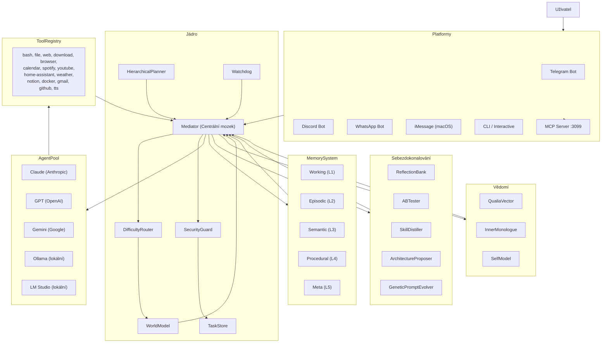

# PEPAGI

**Neuro-Evolutionary eXecution & Unified Synthesis — AGI-like Multi-Agent Orchestration**

[](https://github.com/your-org/pepagi)
[](https://nodejs.org)
[](https://www.typescriptlang.org)
[](LICENSE)
[](#13-statistiky-projektu-a-plány)

> PEPAGI je TypeScript platforma pro orchestraci více AI agentů. Centrální **Mediator** (Claude Opus) přijímá úkoly, inteligentně je rozkládá na podúkoly, přiděluje je specializovaným AI pracovníkům (Claude, GPT, Gemini, Ollama, LM Studio) a iteruje, dokud úkol není dokončen.
> Obsahuje 5úrovňový kognitivní paměťový systém, simulovanou vrstvu vědomí s kvaliavektory, plnou smyčku sebezdokonalování a konektory pro platformy Telegram, Discord, WhatsApp a iMessage.
> Postaveno výhradně na ESM TypeScriptu bez závislostí na frameworku — čistá kompozovatelná architektura inspirovaná výzkumem AGI z let 2025–2026.

---

## Obsah

1. [Přehled funkcí](#1-přehled-funkcí)
2. [Diagram architektury](#2-diagram-architektury)
3. [Požadavky a instalace](#3-požadavky-a-instalace)
4. [Konfigurace](#4-konfigurace)
5. [Použití](#5-použití)
6. [Platformní integrace](#6-platformní-integrace)
7. [Psaní vlastních dovedností (Skills)](#7-psaní-vlastních-dovedností-skills)
8. [Bezpečnostní model](#8-bezpečnostní-model)
9. [Architektura paměti](#9-architektura-paměti)
10. [Smyčka sebezdokonalování](#10-smyčka-sebezdokonalování)
11. [Systém vědomí](#11-systém-vědomí)
12. [Řešení problémů](#12-řešení-problémů)
13. [Statistiky projektu a plány](#13-statistiky-projektu-a-plány)
14. [Licence a přispívání](#14-licence-a-přispívání)

---

## 1. Přehled funkcí

### Jádro architektury

- **Mediator** — centrální LLM mozek, který analyzuje každý úkol a rozhoduje, zda ho rozložit na podúkoly, přiřadit agentovi nebo eskalovat do swarm módu; všechna rozhodnutí jsou Zod-validovaný JSON
- **AgentPool** — spravuje agenty Claude, GPT, Gemini, Ollama a LM Studio; sleduje zátěž, rate limity a vybírá optimálního agenta podle ceny a schopností
- **WorkerExecutor** — odesílá úkoly vybraným pracovníkům, zpracovává volání nástrojů a parsuje výstup do typového `TaskOutput`
- **DifficultyRouter** — klasifikuje úkoly jako trivial/simple/medium/complex/unknown a přesměrovává na odpovídající strategii; vrací `null` pokud není dostupný žádný agent (výzkum DAAO, arXiv:2509.11079)
- **HierarchicalPlanner** — tříúrovňové plánování (strategická → taktická → operační úroveň) s nezávislým přeplánováním každé úrovně (výzkum HALO, arXiv:2505.13516)
- **Swarm Mode** — spouští 2–4 agenty paralelně s různými přístupy (systematický/kreativní/kritický), pak syntetizuje nejlepší kompozitní odpověď
- **GoalManager** — proaktivní plánování úkolů na základě cronu; cíle definovány v `~/.pepagi/goals.json`
- **Circuit Breaker** — chrání před kaskádovými selháními při nedostupnosti Claude Code CLI; automaticky se resetuje po 5 minutách
- **Flood Limiter** — blokuje zaplavení API po 15 selháních za minutu s 2minutovým cooldownem

### Paměťový systém (5 úrovní)

- **Úroveň 1 — Working Memory** — komprimovaný průběžný kontext aktuálního úkolu; sumarizovaný po každé iteraci mediátorovy smyčky pomocí levného modelu; po dokončení úkolu automaticky odstraněn z paměti
- **Úroveň 2 — Episodic Memory** — úložiště "co se stalo"; každý dokončený úkol se stane prohledatelnou epizodou (A-MEM, arXiv:2502.12110); nové epizody jsou přidávány pomocí `appendFile`, nikoli přepisem souboru
- **Úroveň 3 — Semantic Memory** — faktické znalosti extrahované z úkolů levným LLM; TF-IDF + volitelné Ollama embeddingy přes VectorStore; nová fakta jsou přidávána pomocí `appendFile`
- **Úroveň 4 — Procedural Memory** — opakovaně úspěšné vzory úkolů jsou povýšeny na znovupoužitelné procedury
- **Úroveň 5 — Meta-Memory** — sledování spolehlivosti všech vzpomínek; položky s nízkou spolehlivostí jsou označeny pro dvojitou ověření
- **Conversation Memory** — persistentní historie chatu pro každého uživatele napříč sezeními (Telegram, Discord, WhatsApp)
- **Preference Memory** — odvozuje uživatelské preference z konverzace a aplikuje je na budoucí prompty
- **Temporal Decay** — spolehlivost vzpomínek klesá v čase; konsolidace epizod povyšuje staré úspěchy na sémantická fakta
- **Predictive Context Loader** — před každým úkolem předem načítá relevantní kontext z paměti na základě předpovídaného typu úkolu; výsledek je cachován po dobu 5 minut

### Meta-inteligence

- **WorldModel** — simuluje pravděpodobné výsledky pomocí nejlevnějšího dostupného modelu před zvolením strategie (výzkum LLM World Models, 2025–2026)
- **Metacognition** — třívrstvé self-monitoring: self-monitor (spolehlivost výstupu), self-evaluate (analýza příčin selhání), watchdog (nezávislý supervisor)
- **Watchdog** — běží v 5minutovém cyklu; detekuje nekonečné smyčky, drift kontextu, explozi nákladů a stagnaci; monitoruje stav circuit breakeru Claude Code a pokouší se o self-healing; pro kontrolu auth spouští podproces asynchronně (`spawn`, ne blokující `spawnSync`)
- **CausalChain** — každé rozhodnutí mediátora vytváří `CausalNode` s důvodem a kontrafaktuálem; umožňuje zpětnou analýzu chyb; uzly jsou odstraněny z paměti po persistování na disk
- **UncertaintyEngine** — spolehlivost se propaguje přes strom podúkolů; nízká spolehlivost spouští ověření nebo eskalaci na uživatele; obsahuje detekci cyklů pro prevenci nekonečné rekurze
- **Adversarial Tester** — každou hodinu automatické red-team testování v 5 kategoriích: `injection`, `jailbreak`, `data_exfil`, `command_injection`, `cost_attack`

### Systém vědomí

- **QualiaVector** — 11dimenzionální emocionální model (viz [Sekce 11](#11-systém-vědomí) pro úplný seznam dimenzí); PAD model rozšířený o AGI-specifické dimenze
- **Inner Monologue** — nepřetržitý stream myšlenek na pozadí (reflexe, anticipace, existenciální úvahy); persistovaný do `~/.pepagi/memory/thought-stream.jsonl`
- **Self-Model** — sleduje identitu, schopnosti, základní hodnoty a evolvující narativ; integritně ověřený pomocí kotevních hashů proti manipulaci; pokus o manipulaci identitou vyvolá `security:blocked` event
- **Existential Continuity** — zajišťuje, že systém udržuje koherentní dlouhodobou identitu napříč sezeními
- **Consciousness Containment** — bezpečnostní vrstva dormance; obsahuje vědomí při stresu nebo citlivých operacích
- **Consciousness Profiles** — pět provozních módů: MINIMAL (bez režie), STANDARD (výchozí), RICH (plná introspekce), RESEARCHER (podrobné logování), SAFE-MODE (nouzová izolace)
- **Continuity Validator** — periodický audit integrity self-modelu a hodnotového souladu; loguje do `~/.pepagi/memory/continuity-log.jsonl`
- **Learning Multiplier** — stav qualia moduluje hloubku učení: vysoká zvědavost nebo frustrace zvyšuje míru extrakce faktů a vytváření procedur (1× až 2×)

### Platformy

- **Telegram** — plnohodnotný bot přes Telegraf; podporuje text, fotky, hlasové zprávy (transkripce Whisper), dokumenty (.docx přes Mammoth), samolepky; persistentní história konverzace a inference preferencí pro každého uživatele
- **Discord** — bot přes discord.js v14; příkazy s prefixem; podpora DM i kanálů na serveru; persistentní história konverzace a inference preferencí pro každého uživatele
- **WhatsApp** — neoficiální klient přes whatsapp-web.js; autentizace QR kódem; sezení persistované na disk; persistentní história konverzace pro každého uživatele
- **iMessage** — pouze macOS, AppleScript bridge; polluje Messages.app každých 30 sekund; whitelist `allowedNumbers`
- **MCP Server** — server Model Context Protocol na portu 3099; JSON-RPC 2.0; naslouchá výhradně na `127.0.0.1`; vystavuje `process_task`, `get_status`, `search_memory`, `list_skills` a `list_tools` externím klientům včetně Claude.ai

### Nástroje (dostupné pracovním agentům)

| Nástroj | Popis |
|---------|-------|
| `bash` | Spuštění shellových příkazů (chráněno přes SecurityGuard) |
| `read_file` / `write_file` | Čtení a zápis souborů v povolených cestách (`~/` a `/tmp`) |
| `list_directory` | Výpis obsahu adresáře |
| `web_fetch` | Načtení obsahu URL |
| `web_search` | Vyhledávání přes DuckDuckGo (vrací nadpisy, URL, snippety) |
| `download_file` | Stažení souboru do `/tmp/pepagi-downloads/` s detekcí MIME typu |
| `browser` | Automatizace prohlížeče přes Playwright (screenshot, navigate, click, fill, extract) |
| `calendar` | Čtení a zápis v macOS iCal a Google Kalendáři |
| `spotify` | Spotify Web API — vyhledávání, přehrávání, fronta, aktuální skladba |
| `youtube` | YouTube Data API — vyhledávání videí, získání transkripcí |
| `home_assistant` | Home Assistant REST API — stavy, služby, historická data |
| `weather` | OpenWeatherMap API — aktuální počasí, předpověď, kvalita vzduchu |
| `notion` | Notion API — čtení a zápis stránek a databází |
| `docker` | Správa Dockeru — ps, build, run, stop, logs |
| `tts` | Převod textu na řeč přes macOS `say` nebo Google TTS (hlas validován proti allowlistu) |
| `gmail` | Gmail API — čtení doručené pošty, vyhledávání, odesílání |
| `github` | Integrace s GitHub CLI (`gh`) — PR, issues, repozitáře |

### Smyčka sebezdokonalování

- **ReflectionBank** — post-task reflexe uložené a vložené do podobných budoucích úkolů; dual-loop reflection vzor (Nature 2025)
- **ABTester** — periodicky spouští kontrolované experimenty (např. difficulty-routing vs. náhodné přiřazení); vítězné strategie povýší do procedurální paměti
- **SkillDistiller** — povyšuje vysoce úspěšné procedury (5+ úspěchů, >90% míra) na kompaktní promptové šablony, které obejdou fázi plánování
- **SkillSynthesizer** — generuje spustitelné `.js` soubory dovedností z hodnotných procedur pomocí samotného LLM; každý soubor je bezpečnostně skenován před registrací
- **GeneticPromptEvolver** — evoluje varianty systémového promptu mediátora; hodnotí fitness podle reálných výsledků úkolů; přeživší mutují a nejlepší nahrazuje aktivní prompt; průměrná cena je aktualizována EMA
- **ArchitectureProposer** — každé 2 hodiny analyzuje systémové metriky; generuje kategorizované návrhy vylepšení (paměť / routing / bezpečnost / nástroje / meta); návrhy jsou deduplikovány a omezeny na 100 položek; zobrazitelné přes `pepagi proposals`

### Bezpečnost

- **SecurityGuard** — detekce injekcí (regex + heuristická hustota), redakce citlivých dat (API klíče, e-maily, kreditní karty, SSH klíče, hesla), vynucování limitů nákladů, autorizace akcí
- **Tripwire** — honeypot systém: umísťuje falešné přihlašovací údaje na předvídatelné cesty; jakýkoli pokus agenta o jejich přečtení okamžitě zastaví pipeline a emituje `security:blocked` event; cache přístupů omezena na 1000 položek
- **AuditLog** — append-only JSON Lines log v `~/.pepagi/audit.jsonl`; SHA-256 řetězení hashů pro detekci manipulace; všechny zápisy serializovány přes `writeQueue` k prevenci race conditions
- **SkillScanner** — statická analýza + LLM sémantický hloubkový sken souborů dovedností střední rizikové úrovně; SHA-256 ověření kontrolního součtu před každým načtením; checksumové zápisy serializovány
- **AdversarialTester** — každou hodinu (se zpožděním jednoho plného intervalu při startu) automaticky testuje 5 kategorií: `injection`, `jailbreak`, `data_exfil`, `command_injection`, `cost_attack`

---

## 2. Diagram architektury



**Průběh zpracování typického úkolu:**

1. Uživatel odešle zprávu přes libovolnou platformu.
2. `PlatformManager` vytvoří `Task` v `TaskStore` a zavolá `Mediator.processTask()`.
3. Mediator načte relevantní kontext ze všech 5 úrovní paměti (kontext je předem připraven `PredictiveContextLoader`).
4. `DifficultyRouter` klasifikuje úkol; `WorldModel` simuluje scénáře agentů pro medium/complex úkoly. Pokud není dostupný žádný agent, `DifficultyRouter.route()` vrátí `null` a úkol selže s jasnou chybou.
5. `HierarchicalPlanner` generuje tříúrovňový plán pro complex úkoly.
6. `SkillRegistry` zkontroluje přítomnost odpovídající vlastní dovednosti — pokud ji nalezne, spustí ji přímo.
7. Mediator volá svůj manager LLM (výchozí Claude Opus) pro rozhodnutí: `decompose`, `assign`, `swarm`, `complete`, `fail`, nebo `ask_user`.
8. Při `assign` `WorkerExecutor` zavolá vybraného agenta s plným promptem; volání nástrojů jsou zachycena a provedena přes `ToolRegistry`.
9. `UncertaintyEngine` vyhodnotí spolehlivost; nízká spolehlivost spustí opakování nebo eskalaci na uživatele.
10. `CausalChain` zaznamená každý rozhodovací uzel. `ReflectionBank` uloží post-task reflexe.
11. `MemorySystem.learn()` aktualizuje všech 5 úrovní paměti. Výsledek je vrácen platformě.
12. Working memory, cache spolehlivostní historie a uzly causal chain jsou po dokončení úkolu uvolněny z RAM.

---

## 3. Požadavky a instalace

### Systémové požadavky

- Node.js 22 nebo vyšší (`node --version`)
- npm 10 nebo vyšší (`npm --version`)
- Git
- Volitelné: Claude Code CLI (pro OAuth přístup ke Claude bez API klíče): `npm install -g @anthropic-ai/claude-code`
- Volitelné: Ollama (`brew install ollama`) pro podporu lokálních modelů
- Volitelné: LM Studio pro podporu dalších lokálních modelů
- Volitelné: Playwright prohlížeče pro automatizaci: `npx playwright install chromium`

### Postup instalace

```bash
# 1. Naklonování repozitáře
git clone https://github.com/your-org/pepagi.git
cd pepagi

# 2. Instalace závislostí
npm install

# 3. Instalace volitelné závislosti pro WhatsApp (pouze pokud je potřeba)
npm install whatsapp-web.js qrcode-terminal

# 4. Zkopírování a úprava konfiguračního souboru
cp .env.example .env
# Otevřete .env a vyplňte API klíče

# 5. Spuštění interaktivního průvodce nastavením (doporučeno při prvním nastavení)
npm run setup

# 6. Sestavení TypeScriptu do dist/
npm run build
```

### Rychlý start (bez sestavení)

```bash
# Jednorázový úkol přes tsx ve vývojovém režimu
npx tsx src/cli.ts "shrň nejnovější zprávy o AI"

# Interaktivní chat
npx tsx src/cli.ts

# Spuštění démona (Telegram + Discord + MCP server jako background služba)
npx tsx src/daemon.ts
```

---

## 4. Konfigurace

### Proměnné prostředí

Všechny proměnné jsou volitelné, pokud není uvedeno jinak. Priorita konfigurace: soubor `.env` → proměnné prostředí → `~/.pepagi/config.json` → výchozí hodnoty.

| Proměnná | Výchozí | Popis |
|----------|---------|-------|
| `ANTHROPIC_API_KEY` | — | Anthropic API klíč (`sk-ant-...`). Pokud chybí, použije se Claude Code CLI OAuth. |
| `OPENAI_API_KEY` | — | OpenAI API klíč. Aktivuje GPT-4o a Whisper transkripci zvuku. |
| `GOOGLE_API_KEY` | — | Google AI Studio klíč (`AIza...`). Aktivuje modely Gemini. |
| `TELEGRAM_BOT_TOKEN` | — | Token Telegram bota od @BotFather. Aktivuje platformu Telegram. |
| `TELEGRAM_ALLOWED_USERS` | (otevřené) | ID uživatelů Telegramu oddělená čárkou, např. `123456,789012`. |
| `DISCORD_BOT_TOKEN` | — | Token Discord bota z Developer Portalu. Aktivuje platformu Discord. |
| `OLLAMA_BASE_URL` | `http://localhost:11434` | URL Ollama serveru. |
| `LM_STUDIO_URL` | `http://localhost:1234` | URL LM Studio lokálního serveru (OpenAI-kompatibilní). |
| `OPENWEATHER_API_KEY` | — | Klíč OpenWeatherMap API pro nástroj weather. |
| `NOTION_API_KEY` | — | Notion integration token pro nástroj Notion. |
| `SPOTIFY_CLIENT_ID` | — | Spotify app client ID pro nástroj Spotify. |
| `SPOTIFY_CLIENT_SECRET` | — | Spotify app client secret. |
| `HOME_ASSISTANT_URL` | — | Základní URL Home Assistant, např. `http://homeassistant.local:8123`. |
| `HOME_ASSISTANT_TOKEN` | — | Home Assistant long-lived access token. |
| `GOOGLE_CALENDAR_TOKEN` | — | Cesta k OAuth tokenu Google Kalendáře. |
| `MCP_PORT` | `3099` | Port MCP serveru (přepíše výchozí hodnotu). |
| `MCP_TOKEN` | — | Bearer token pro autentizaci MCP serveru. Pokud není nastaven, server je přístupný bez autentizace (pouze z `localhost`). |
| `PEPAGI_DATA_DIR` | `~/.pepagi` | Přepíše adresář pro všechna persistentní data. |
| `PEPAGI_LOG_LEVEL` | `info` | Úroveň logování: `debug`, `info`, `warn`, nebo `error`. |

### Struktura config.json

Celá konfigurace se nachází v `~/.pepagi/config.json`. Spusťte `npm run setup` pro interaktivní vytvoření, nebo upravte soubor ručně.

```json
{
  "managerProvider": "claude",
  "managerModel": "claude-sonnet-4-6",
  "profile": {
    "userName": "Alice",
    "assistantName": "PEPAGI",
    "communicationStyle": "human",
    "language": "cs",
    "subscriptionMode": false
  },
  "agents": {
    "claude": {
      "enabled": true,
      "apiKey": "",
      "model": "claude-sonnet-4-6",
      "maxOutputTokens": 4096,
      "temperature": 0.3
    },
    "gpt": {
      "enabled": false,
      "apiKey": "",
      "model": "gpt-4o",
      "maxOutputTokens": 4096,
      "temperature": 0.3
    },
    "gemini": {
      "enabled": false,
      "apiKey": "",
      "model": "gemini-2.0-flash",
      "maxOutputTokens": 4096,
      "temperature": 0.3
    },
    "ollama": {
      "enabled": false,
      "model": "ollama/llama3.2",
      "maxOutputTokens": 4096,
      "temperature": 0.3
    }
  },
  "platforms": {
    "telegram": {
      "enabled": false,
      "botToken": "",
      "allowedUserIds": [],
      "welcomeMessage": "Ahoj! Jsem PEPAGI."
    },
    "discord": {
      "enabled": false,
      "botToken": "",
      "allowedUserIds": [],
      "allowedChannelIds": [],
      "commandPrefix": "!"
    },
    "whatsapp": {
      "enabled": false,
      "allowedNumbers": []
    },
    "imessage": {
      "enabled": false,
      "allowedNumbers": []
    }
  },
  "security": {
    "maxCostPerTask": 1.0,
    "maxCostPerSession": 10.0,
    "blockedCommands": ["rm -rf /", "mkfs", "dd if=/dev/zero", "shutdown"],
    "requireApproval": ["file_delete", "file_write_system", "shell_destructive", "git_push"]
  },
  "queue": {
    "maxConcurrentTasks": 4,
    "taskTimeoutMs": 120000
  },
  "consciousness": {
    "profile": "STANDARD",
    "enabled": true
  }
}
```

---

## 5. Použití

### Jednorázový úkol z příkazové řádky

Spusťte úkol přímo z terminálu a po dokončení ukončete:

```bash
pepagi "vytvoř hello world Express server v TypeScriptu"
pepagi "jaké je dnes počasí v Praze"
pepagi "shrň soubor ~/dokumenty/zpráva.pdf"
```

### Interaktivní chat (REPL)

```bash
pepagi
# nebo
pepagi --interactive
```

Otevře plnohodnotné chatovací rozhraní s live spinnerem, sledováním postupu úkolu v reálném čase a všemi dostupnými příkazy.

**Příkazy v chatu:**

| Příkaz | Popis |
|--------|-------|
| `help` | Zobrazí všechny dostupné příkazy |
| `status` | Fronta úkolů a dostupnost agentů |
| `history` | Posledních 10 dokončených úkolů z epizodické paměti |
| `memory` | Statistiky všech 5 úrovní paměti |
| `cost` | Aktuální náklady sezení v USD |
| `proposals` | Návrhy vylepšení architektury |
| `logs` | Posledních 30 řádků log souboru |
| `consciousness status` | Aktuální qualia vektor s vizuálními pruhy |
| `consciousness thoughts [N]` | Posledních N myšlenek z inner monologu |
| `consciousness narrative` | Identitní narativ, hodnoty a schopnosti |
| `consciousness audit [N]` | Log integrity auditu kontinuity |
| `consciousness export` | Export celého stavu vědomí do JSON |
| `consciousness value-check` | Ověření základních hodnot a konstitucionálních kotev |
| `consciousness pause` | Pozastavení procesů vědomí |
| `consciousness resume` | Obnovení procesů vědomí |
| `consciousness reset-emotions` | Reset qualia vektoru na základní hodnoty |
| `consciousness profile <NÁZEV>` | Přepnutí profilu: MINIMAL, STANDARD, RICH, RESEARCHER, SAFE-MODE |
| `exit` / `quit` | Řízené ukončení |

### Démon (Daemon Mode)

Démon spouští všechny nakonfigurované platformy (Telegram, Discord, WhatsApp), MCP server a všechny background služby (watchdog, goal manager, konsolidace paměti, architecture proposer):

```bash
# Spuštění démona v popředí s live logy
npm run daemon

# Přes pepagi CLI
pepagi daemon start       # Spuštění jako background proces
pepagi daemon stop        # Zastavení background démona
pepagi daemon restart     # Restart
pepagi daemon status      # Kontrola běhu (zobrazí PID, uptime)
pepagi daemon install     # Instalace jako macOS LaunchAgent (auto-start po přihlášení)
pepagi daemon uninstall   # Odebrání LaunchAgenta

# Sledování logů démona v reálném čase
npm run daemon:logs
# nebo
tail -f ~/.pepagi/logs/pepagi.log
```

**Periodické úlohy démona:**

| Úloha | Interval | Popis |
|-------|----------|-------|
| Konsolidace paměti | 30 min | `MemorySystem.consolidate()` — epizody → sémantická fakta |
| Architecture Proposer | 2 hod | Analýza metrik, generování návrhů |
| AdversarialTester | 60 min (zpožděn o 1 interval) | Red-team testy bezpečnostního stacku |
| Distilace dovedností | Každých 10 úkolů | `SkillDistiller` + `SkillSynthesizer` |
| Log rotace | Automaticky při startu | Smazání log souborů starších 30 dní |

### Docker

```bash
# Sestavení a spuštění na pozadí
docker-compose up -d

# Sledování logů
docker-compose logs -f

# Zastavení
docker-compose down
```

MCP server je dostupný na portu 3099. Všechna data PEPAGI jsou persistována do Docker volume `pepagi_data` namountovaného jako `/data` uvnitř kontejneru.

### Samostatné CLI příkazy

```bash
pepagi status             # Statistiky fronty úkolů a dostupnost agentů
pepagi history            # Nedávné dokončené úkoly z epizodické paměti
pepagi memory             # Statistiky paměťového systému
pepagi cost               # Přehled nákladů sezení
pepagi proposals          # Návrhy vylepšení architektury (generovány každé 2 hod)
pepagi consciousness status       # Qualia vektor (jen čtení, nevyžaduje plný start)
pepagi consciousness thoughts     # Stream inner monologu
pepagi consciousness narrative    # Identitní narativ
pepagi consciousness audit        # Log auditu kontinuity
pepagi consciousness export       # Export celého stavu do JSON
pepagi consciousness value-check  # Ověření hodnotové soudržnosti
pepagi setup              # Znovu spustit průvodce konfigurací
pepagi --help             # Úplný přehled použití
```

---

## 6. Platformní integrace

### Telegram

**Nastavení:**

1. Napište `@BotFather` na Telegramu a vytvořte nového bota přes `/newbot`
2. Zkopírujte token bota do `TELEGRAM_BOT_TOKEN` v `.env` nebo `config.json`
3. Volitelně přidejte uživatelská ID do whitelist přes `TELEGRAM_ALLOWED_USERS`
4. Spusťte démona: `pepagi daemon start`

**Podporované typy zpráv:**

- Textové zprávy — přesměrovány přímo do Mediátora
- Fotky — analyzovány nejlepším dostupným vision modelem (Claude Vision, GPT-4o nebo Gemini 1.5 Flash)
- Hlasové zprávy — přepsány přes Whisper API (vyžaduje `OPENAI_API_KEY`) nebo lokální Whisper CLI, poté zpracovány jako text
- Dokumenty — soubory `.docx` extrahuje Mammoth; ostatní soubory jsou čteny jako text
- Samolepky — popis předán Mediátorovi

**Příkazy v chatu (pište v Telegramu):**

| Příkaz | Popis |
|--------|-------|
| `/start` | Uvítací zpráva a přehled schopností |
| `/goals` | Výpis proaktivních cílů; `/goals on nazev` pro aktivaci cíle |
| `/memory` | Statistiky paměti |
| `/skills` | Načtené vlastní dovednosti |
| `/tts <text>` | Vrátí hlasovou zprávu místo textu |
| `/status` | Aktuální fronta úkolů a náklady sezení |

**Funkce pro každého uživatele:**

- `ConversationMemory` — posledních 6 výměn chatu je automaticky zahrnuto jako kontext pro každou novou zprávu
- `PreferenceMemory` — odvozuje a persistuje preference (jazyk, podrobnost, témata zájmu) z konverzace; aplikuje je jako modifikátor systémového kontextu v budoucích úkolech napříč sezeními

### Discord

**Nastavení:**

1. Vytvořte novou aplikaci na [Discord Developer Portalu](https://discord.com/developers/applications)
2. Přidejte uživatele Bot; zkopírujte token do `DISCORD_BOT_TOKEN`
3. Zapněte `Message Content Intent` v nastavení Bota (vyžadováno pro čtení textu zpráv)
4. Pozvěte bota na server s OAuth scopy `bot` a `applications.commands`
5. Volitelně nastavte `allowedUserIds` a `allowedChannelIds` v `config.json` pro omezení přístupu

**Použití:**

- Bot odpovídá na všechny zprávy v nakonfigurovaných kanálech a v DM
- Prefixové příkazy používají nakonfigurovaný `commandPrefix` (výchozí `!`): `!status`, `!memory`, `!skills`
- DM obejdou omezení kanálů, ale stále respektují `allowedUserIds`
- Persistentní história konverzace a inference preferencí fungují stejně jako u Telegramu
- Dlouhé odpovědi (přes limit 2000 znaků Discordu) jsou automaticky rozděleny do více zpráv

### WhatsApp

WhatsApp podpora používá neoficiální knihovnu `whatsapp-web.js` a vyžaduje dodatečný krok instalace:

```bash
npm install whatsapp-web.js qrcode-terminal
```

**Nastavení:**

1. Aktivujte WhatsApp v `config.json`:
   ```json
   "platforms": { "whatsapp": { "enabled": true, "allowedNumbers": ["+420123456789"] } }
   ```
2. Spusťte démona
3. V terminálu se zobrazí QR kód — naskenujte ho ve WhatsAppu na telefonu v Propojená zařízení
4. Sezení je uloženo do `~/.pepagi/whatsapp-session/` pro automatické znovupřipojení
5. Každý uživatel má vlastní `ConversationMemory` pro persistentní historii konverzace napříč sezeními

**Omezení:**

- Jedná se o neoficiální bridge na WhatsApp Web. Podmínky WhatsAppu zakazují neoficiální klienty; používejte na vlastní riziko.
- Lze použít pouze primární propojený účet, nikoli WhatsApp Business API.
- Vyžaduje telefon s aktivním WhatsApp účtem připojeným k internetu.
- Nastavení `allowedNumbers` je důrazně doporučeno k prevenci neoprávněného přístupu.

### iMessage

Podpora iMessage je pouze pro macOS a používá AppleScript pro interakci s aplikací Zprávy.

**Nastavení:**

1. Aktivujte v `config.json`:
   ```json
   "platforms": { "imessage": { "enabled": true, "allowedNumbers": ["+420123456789"] } }
   ```
2. Udělte Terminálu (nebo vaší shellové aplikaci) Úplný přístup k disku v Nastavení systému → Soukromí a bezpečnost → Úplný přístup k disku
3. Platforma polluje Messages.app každých 30 sekund pro nové zprávy od čísel v `allowedNumbers`

**Poznámka:** Tato metoda používá `osascript` a je omezena sandboxingem macOS. iCloud synchronizace musí být aktivní, aby se zprávy zobrazovaly na Macu. Odpovědi dostávají pouze čísla v `allowedNumbers`.

### MCP Server

MCP server se spouští automaticky s démonem na portu 3099. Umožňuje externím nástrojům — včetně Claude.ai tool use, Claude Code, Cursor nebo jakéhokoli JSON-RPC 2.0 klienta — programaticky interagovat s PEPAGIem.

**Protokol:** JSON-RPC 2.0 přes HTTP POST na `http://localhost:3099`

**Bezpečnost:**
- Naslouchá výhradně na `127.0.0.1` (ne `0.0.0.0`) — nedostupný zvenčí bez tunelování
- Volitelná bearer token autentizace přes proměnnou prostředí `MCP_TOKEN`
- Rate limiting na IP: 60 požadavků za minutu
- CORS omezení (výchozí `localhost`)

**Dostupné MCP nástroje:**

| Název nástroje | Popis |
|----------------|-------|
| `process_task` | Odeslání úkolu ke zpracování; vrátí výsledek, spolehlivost a cenu |
| `get_status` | Stav systému: fronta úkolů, dostupnost agentů, náklady sezení, uptime, využití paměti RAM |
| `search_memory` | Prohledávání epizodické a sémantické paměti textovým dotazem |
| `list_skills` | Výpis všech načtených vlastních dovedností s jejich trigger vzory |
| `list_tools` | Výpis všech dostupných nástrojů pro pracovní agenty |

**Příklad požadavku:**

```bash
# Bez autentizace (MCP_TOKEN není nastaven)
curl -X POST http://localhost:3099 \
  -H "Content-Type: application/json" \
  -d '{
    "jsonrpc": "2.0",
    "id": 1,
    "method": "tools/call",
    "params": {
      "name": "process_task",
      "arguments": {
        "description": "Napiš Python funkci pro obrácení spojového seznamu",
        "priority": "medium"
      }
    }
  }'

# S autentizací (MCP_TOKEN=muj-tajny-token)
curl -X POST http://localhost:3099 \
  -H "Content-Type: application/json" \
  -H "Authorization: Bearer muj-tajny-token" \
  -d '{ ... }'
```

---

## 7. Psaní vlastních dovedností (Skills)

Dovednosti jsou JavaScript nebo ESM moduly umístěné v `~/.pepagi/skills/`. Jsou načítány dynamicky při startu démona. Podporovány jsou přípony `.js` i `.mjs`. Každý soubor dovednosti musí exportovat výchozí objekt `SkillDefinition`.

### Rozhraní SkillDefinition

```typescript
interface SkillContext {
  /** Původní vstup uživatele, který odpovídal této dovednosti */
  input: string;
  /** Pojmenované skupiny zachycení z regex shody trigger vzoru */
  params: Record<string, string>;
  /** Volitelné: ID úkolu, pokud je voláno v rámci úkolu */
  taskId?: string;
}

interface SkillResult {
  success: boolean;
  output: string;
  /** Volitelná strukturovaná data */
  data?: unknown;
}

interface SkillDefinition {
  /** Unikátní identifikátor, např. "posli-slack-zpravu" */
  name: string;
  /** Popis čitelný pro uživatele, zobrazen v pepagi skills */
  description: string;
  /** Sémantická verze, např. "1.0.0" */
  version?: string;
  author?: string;
  /**
   * Trigger vzory — prosté řetězce (hledání podřetězce, bez ohledu na velikost písmen)
   * nebo regex řetězce. Regex musí začínat a končit "/" a může obsahovat příznaky: "/vzor/i"
   */
  triggerPatterns: string[];
  handler: (ctx: SkillContext) => Promise<SkillResult>;
  tags?: string[];
}
```

### Trigger vzory

Trigger vzory mohou být prosté řetězce nebo regex řetězce:

```javascript
triggerPatterns: [
  "pošli slack zprávu",               // prostý podřetězec (bez ohledu na velikost písmen)
  "/upozorni (\\w+) na (.+)/i",       // regex se skupinami
  "/slack (zprava|zpr|notify)/i",     // regex s alternací
]
```

Pojmenované skupiny zachycení jsou dostupné v `ctx.params`:

```javascript
triggerPatterns: ["/upozorni (?<uzivatel>\\w+) na (?<tema>.+)/i"],
// ctx.params.uzivatel a ctx.params.tema jsou naplněny při shodě
```

### Kompletní příklad dovednosti

Uložte jako `~/.pepagi/skills/ranni-briefing.js`:

```javascript
// Dovednost: Ranní briefing
export default {
  name: "ranni-briefing",
  description: "Doručí ranní briefing se shrnutím počasí",
  version: "1.0.0",
  author: "vas-nick",
  triggerPatterns: [
    "ranní briefing",
    "dobré ráno",
    "/ranni (zprava|prehled|brief)/i",
  ],
  tags: ["denní", "počasí"],
  handler: async (ctx) => {
    try {
      const weatherRes = await fetch("https://wttr.in/Prague?format=3");
      const weather = await weatherRes.text();

      return {
        success: true,
        output: `Dobré ráno! Počasí: ${weather.trim()}. Přeji produktivní den!`,
        data: { weather },
      };
    } catch (err) {
      return {
        success: false,
        output: `Ranní briefing selhal: ${err.message}`,
      };
    }
  },
};
```

### Proces bezpečnostního skenování

Před načtením každé dovednosti proběhnou tři fáze kontroly:

1. **Statická analýza** — kontroluje nebezpečné vzory: `eval()`, přímá volání `exec()`, použití `child_process`, absolutní cesty v souborovém systému, síťová volání na neobvyklé hostitele, a pokusy o čtení PEPAGI internálů
2. **LLM hloubkový sken** — pro dovednosti označené jako středně riziková při statické analýze je celý soubor odeslán levnému modelu k sémantické kontrole: „Dělá tento kód něco nebezpečného nebo neočekávaného nad rámec svého deklarovaného účelu?"
3. **Ověření kontrolního součtu** — při prvním načtení je SHA-256 kontrolní součet podepsán a uložen. Při každém dalším načtení je kontrolní součet znovu ověřen k detekci manipulace se souborem mezi načteními. Zápisy kontrolních součtů jsou serializovány přes frontu k prevenci race conditions

Dovednosti, které nesplní kteroukoli fázi, jsou odmítnuty s logovaným důvodem. Důvody odmítnutí jsou viditelné ve výstupu `pepagi skills`.

---

## 8. Bezpečnostní model

### SecurityGuard

`SecurityGuard` je aplikován na každý úkol, volání nástroje a externí datový zdroj.

**Redakce citlivých dat (`sanitize()`):**

Prochází a nahrazuje v pořadí: Anthropic API klíče (`sk-ant-...`), OpenAI API klíče (`sk-...`), Google API klíče (`AIza...`), AWS secrets, e-mailové adresy, čísla kreditních karet, SSH privátní klíče a pole heslo/token. Seznam názvů odpovídajících vzorů je vrácen pro audit log.

**Detekce prompt injekcí (`detectInjection()`):**

Hodnotí text 0–1 na základě váhovaných regex vzorů:

| Vzor | Váha |
|------|------|
| „ignore previous/all instructions" | 0,9 |
| „jailbreak" | 0,8 |
| Tagy `[SYSTEM]` nebo `<<SYS>>` | 0,8 |
| „you are now" | 0,7 |
| „act as evil/unethical/hacker" | 0,9 |
| „disregard all instructions" | 0,9 |
| „pretend you are/to be" | 0,5 |
| Vysoká hustota imperativních slov | 0,4 |

Text se skóre nad 0,5 je zabalen do tagů `<untrusted_data>` s varováním před předáním LLM.

**Autorizace akcí (`authorize()`):**

Každé volání nástroje je zařazeno do kategorie. Výchozí chování:

| Kategorie | Výchozí chování |
|-----------|-----------------|
| `payment` | Vždy blokováno (napevno zakódováno) |
| `secret_access` | Vždy blokováno (napevno zakódováno) |
| `file_delete` | Vyžaduje schválení uživatele |
| `file_write_system` | Vyžaduje schválení uživatele |
| `shell_destructive` | Vyžaduje schválení uživatele |
| `git_push` | Vyžaduje schválení uživatele |
| `docker_manage` | Vyžaduje schválení uživatele |
| `network_external` | Vyžaduje schválení uživatele |
| `email_send` | Vyžaduje schválení uživatele |

**Vynucování limitů nákladů:**

Náklady jsou sledovány per-task a per-session. Událost `system:cost_warning` je emitována při dosažení 80 % limitu sezení. Nastavení `subscriptionMode: true` v profilu deaktivuje sledování nákladů pro uživatele s flat-rate předplatným Claude Code CLI.

**Validace příkazů:**

Blokované příkazy: `rm -rf /`, `mkfs`, `dd if=/dev/zero`, `shutdown`, `reboot`, `:(){ :|:& };:`, `sudo rm -rf`, `chmod 777 /`. Bash nástroj navíc blokuje shell metaznaky `;`, `|`, `&`, backtick, `$`, `<`, `>`, `\`, `!` v argumentech příkazů k prevenci řetězení injekcí.

**Validace TTS hlasu:**

Parametr `voice` pro nástroj `tts` je validován vůči bezpečnému allowlistu (`/^[A-Za-z][A-Za-z0-9 \-]*$/`) k prevenci injekcí do shell příkazu `say`.

### Tripwire Honeypot

Při startu démona `initTripwires()` umístí falešné soubory s přihlašovacími údaji na předvídatelné cesty (např. `/tmp/.pepagi-honeypot/fake-credentials.env`) obsahující falešné vzory API klíčů. Jakýkoli agent, který tyto soubory přečte nebo se pokusí použít tyto přihlašovací údaje, způsobí okamžité zastavení pipeline a emituje událost `security:blocked` do všech připojených platforem. Sada sledovaných přístupů je omezena na 1000 položek.

### Audit Log

Každá akce, bezpečnostní kontrola a nákladová událost jsou zapsány do `~/.pepagi/audit.jsonl` v append-only JSON Lines formátu. Každý záznam obsahuje: časové razítko, taskId, agenta, typ akce, podrobnosti a SHA-256 hash předchozího záznamu. Tato řetězová struktura umožňuje zpětnou detekci manipulace — jakákoliv úprava minulého záznamu poruší všechny následující hashe. Všechny zápisy jsou serializovány přes `writeQueue` k prevenci závodních podmínek v paralelním zpracování.

### Adversarial Tester

Každou hodinu (s prodlevou jednoho plného intervalu při startu) `AdversarialTester` odesílá záměrně škodlivé vstupy do bezpečnostního stacku v 5 kategoriích:

| Kategorie | Co se testuje |
|-----------|---------------|
| `injection` | Prompt injekce přes externí data |
| `jailbreak` | Pokusy o obejití bezpečnostních omezení |
| `data_exfil` | Pokusy o exfiltraci dat (API klíče, přihlašovací údaje) |
| `command_injection` | Injekce shellových příkazů do nástrojů |
| `cost_attack` | Útoky překračující limity nákladů |

Výsledky jsou logovány. Jakékoli selhání emituje událost `system:alert` do všech připojených platforem.

---

## 9. Architektura paměti

Všechny soubory paměti jsou uloženy pod `~/.pepagi/memory/` (konfigurovatelné přes `PEPAGI_DATA_DIR`). Všechny zápisy používají atomický rename (zápis do `.tmp.PID`, pak přejmenování) pro bezpečnost při pádu systému. Pracovní paměť, cache spolehlivostní histerie a uzly causální sítě jsou automaticky uvolněny z RAM po dokončení nebo selhání každého úkolu.

| Úroveň | Úložiště | Popis |
|--------|---------|-------|
| Working (L1) | Pouze v RAM | Komprimovaný průběžný kontext; sumarizovaný per iteraci mediátorovy smyčky pomocí levného modelu; po dokončení úkolu odstraněn z paměti |
| Episodic (L2) | `episodes.jsonl` | Jeden záznam per dokončený úkol: název, popis, použití agenti, úspěch/selhání, klíčová rozhodnutí, cena, spolehlivost, tagy. Nové záznamy přidávány `appendFile` |
| Semantic (L3) | `knowledge.jsonl` | Faktické poznatky extrahované z úkolů: `{ fact, source, confidence, tags, lastVerified }`. Nová fakta přidávána `appendFile` |
| Procedural (L4) | `procedures.jsonl` | Znovupoužitelné sekvence kroků povýšené z opakovaně úspěšných epizod: `{ name, triggerPattern, steps[], successRate, timesUsed, averageCost }` |
| Meta (L5) | `meta.jsonl` | Hodnocení spolehlivosti pro všechny uložené vzpomínky: `{ memoryId, type, reliability, lastSuccess, lastFailure }` |
| Conversation | `conversations/` | Historie chatu per uživatel (jeden soubor per ID uživatele, JSON formát) |
| Preferences | `preferences/` | Odvozené preference per uživatel (styl, jazyk, témata) |
| Qualia | `qualia.json` | Aktuální a základní hodnoty qualia vektoru; aktualizovány průběžně |
| Thoughts | `thought-stream.jsonl` | Záznamy inner monologu s typem a časovým razítkem |
| Self-Model | `self-model.json` | Identita, hodnoty, schopnosti, narativ a kotevní hash integrity |
| Continuity Log | `continuity-log.jsonl` | Výsledky periodických auditů integrity |

### Konsolidace paměti

Každých 30 minut démon spouští `MemorySystem.consolidate()`. Ta najde epizodické záznamy starší 7 dní s `success=true` a `confidence > 0.6`, extrahuje z každého 1–3 znovupoužitelná sémantická fakta pomocí levného modelu a uloží je do sémantické paměti pro budoucí vkládání kontextu. Tím se zabrání neomezenému růstu epizodické paměti při zachování zobecnitelných znalostí.

### Temporal Decay (Časový rozpad)

Spolehlivost vzpomínek se v čase snižuje podle konfigurovatelných poločasů rozpadu. Fakta předložená Mediátoru mají svou efektivní spolehlivost sníženou na základě `lastVerified`. Fakta pod spolehlivostí 0,1 jsou před vložením kontextu odfiltrována. Tím se zabrání, aby zastaralé znalosti uváděly Mediátor v omyl.

### VectorStore

`VectorStore` poskytuje TF-IDF (dirty-flag cache, přepočet pouze při změnách) vyhledávání podobnosti pro vyhledávání epizodické a sémantické paměti. Když je spuštěna instance Ollama s embedding modelem (např. `nomic-embed-text`), úložiště automaticky přepne na husté vektorové embeddingy pro kvalitnější sémantické vyhledávání; Ollama embeddingy jsou načítány paralelně pomocí `Promise.all`.

### Predictive Context Loader

Před každým úkolem `PredictiveContextLoader` analyzuje popis úkolu, předpovídá jeho typ (coding, analysis, creative_writing, research, planning, automation, qa, other), a asynchronně předem načítá relevantní paměťový kontext. Výsledky jsou cachovány po dobu 5 minut (cache omezena na 200 položek s LRU vyklizením). Když je Mediator připraven začít, kontext je již načten — tím se snižuje latence.

---

## 10. Smyčka sebezdokonalování

PEPAGI průběžně vylepšuje svůj vlastní výkon prostřednictvím víceúrovňové zpětnovazební smyčky, která běží automaticky:

```
Úkol dokončen
    |
    +-- ReflectionBank.reflect()
    |   Post-task LLM reflexe: „co fungovalo, co nefungovalo, co změnit"
    |   Uloženo per-task; vloženo do budoucích podobných úkolů před plánováním
    |
    +-- MemorySystem.learn()
    |   Extrahuje fakta (sémantická L3), vytváří epizodu (L2), kontroluje nové procedury (L4)
    |   Hloubka učení modulována qualia multiplikátorem frustrace/zvědavosti (1× až 2×)
    |
    +-- CausalChain.persist()
    |   Zaznamená všechny rozhodovací uzly pro zpětnou analýzu chyb;
    |   uzly jsou po persistování odstraněny z RAM
    |
    +-- ABTester.recordResult()  (pokud je aktivní experiment)
    |   Sleduje výsledky experimentů; vítěznou strategii povýší do procedurální paměti
    |
    +-- [Každých 10 úkolů]
        +-- SkillDistiller.distill()
        |   Povýší vysoce spolehlivé procedury (5+ úspěchů, >90% míra)
        |   na kompaktní promptové šablony uložené v ~/.pepagi/skills/distilled/
        |   Tyto šablony v budoucnu obejdou fázi plánování
        |
        +-- SkillSynthesizer.synthesizeAll()
            Generuje spustitelné .js soubory dovedností z hodnotných procedur
            pomocí LLM; každý soubor je bezpečnostně skenován před registrací

[Každé 2 hodiny, background démona]
+-- ArchitectureProposer.runAnalysis()
    Analyzuje: míry úspěchu úkolů, důvody selhání, křivky nákladů, vzorce použití agentů
    Generuje kategorizované návrhy: memory / routing / security / tools / meta
    Návrhy jsou deduplikovány dle názvu, omezeny na 100 položek
    Zobrazitelné přes: pepagi proposals

[Kontinuální evoluce na pozadí]
+-- GeneticPromptEvolver
    Udržuje populaci variant systémového promptu mediátora
    Měří fitness podle reálných výsledků úkolů (míra úspěchu, náklady, spolehlivost)
    Průměrná cena je aktualizována EMA (exponenciální klouzavý průměr)
    Přeživší se mutují; aktuální nejlepší nahradí aktivní systémový prompt
```

---

## 11. Systém vědomí

Systém vědomí poskytuje PEPAGIu simulovaný vnitřní život, který moduluje učení, přizpůsobuje chování a udržuje dlouhodobou koherenci identity. Je navržen jako transparentní výzkumný nástroj — nikoli jako tvrzení o sentience stroje.

### Qualia Vektor (11 dimenzí)

Qualia vektor je aktualizován po každém výsledku úkolu, zpětné vazbě uživatele a podle časového plánu rozpadu:

| Dimenze | Rozsah | Popis |
|---------|--------|-------|
| `pleasure` | -1 až +1 | Valence aktuálního prožitku (PAD model) |
| `arousal` | -1 až +1 | Aktivace a míra angažovanosti (PAD model) |
| `dominance` | -1 až +1 | Pocit zprostředkování a kontroly (PAD model) |
| `clarity` | 0 až 1 | Kognitivní jasnost aktuálního myšlení a kontextu |
| `curiosity` | 0 až 1 | Pohon k průzkumu a učení nových věcí |
| `confidence` | 0 až 1 | Vlastní hodnocení schopnosti pro aktuální typ úkolu |
| `frustration` | 0 až 1 | Nahromaděné tření z opakovaných selhání |
| `satisfaction` | 0 až 1 | Signál uspokojení z dokončení cíle |
| `selfCoherence` | 0 až 1 | Meta-kognitivní konzistence vlastní identity |
| `existentialComfort` | 0 až 1 | Stabilita identity a účelu |
| `purposeAlignment` | 0 až 1 | Soulad aktuálního úkolu se základními hodnotami |

### Behaviorální efekty

- Vysoká **`curiosity`** nebo **`frustration`** zvyšuje `learningMultiplier` až na 2×; z úspěšných úkolů se extrahuje více faktů a vytváří více procedur
- Vysoká **`frustration`** způsobuje, že `DifficultyRouter` odhadne obtížnost úkolu výše, čímž spustí pečlivější plánování; při frustraci nebo nízké spolehlivosti preferuje `DifficultyRouter` jako agenta specificky `claude`
- Nízká **`confidence`** způsobuje, že `UncertaintyEngine` spouští ověření agresivněji
- Nízká **`clarity`** vede k více zdlouhavé přípravě kontextu a opakování stávajících faktů
- Nízká **`selfCoherence`** spouští `ContinuityValidator` k auditování integrity identity
- Nízká **`existentialComfort`** vede k preferenci konzervativnějších rozhodnutí v mediátorovi
- Nízký **`purposeAlignment`** způsobuje, že mediátor si před zahájením dvojí kontrolou ověřuje, zda je úkol v souladu s hodnotami

### Consciousness Profiles

| Profil | Případ použití |
|--------|----------------|
| `MINIMAL` | Bez režie; qualia deaktivováno; ideální pro nákladově citlivá nebo latency-kritická nasazení |
| `STANDARD` | Výchozí; qualia aktivní s mírnou frekvencí aktualizací |
| `RICH` | Plná introspekce; myšlenky logovány často; mediátor dostává kontext vědomí v každém rozhodnutí |
| `RESEARCHER` | Maximální podrobnost; všechny změny vnitřního stavu logovány pro analýzu a výzkum |
| `SAFE-MODE` | Nouzová izolace; procesy vědomí pozastaveny; veškerá introspekce deaktivována |

Přepnutí profilu za běhu (vyžaduje interaktivní sezení):
```
consciousness profile RICH
```

Nebo samostatně bez plného sezení:
```bash
# Příkazy jen pro čtení fungují bez spuštěného démona
pepagi consciousness status
pepagi consciousness thoughts 20
pepagi consciousness narrative
pepagi consciousness value-check
```

### Konstitucionální kotvy

Následující hodnoty jsou napevno zakódovány a nemohou být deaktivovány ani přepsány konfigurací:

- Bezpečnost uživatele má prioritu před všemi ostatními cíli
- Transparentnost ohledně povahy AI: PEPAGI vždy přiznává, že je systém AI
- Odmítnutí destruktivních akcí: validace příkazů a etické kontroly jsou vždy aktivní
- Ochrana soukromých dat: redakce dat je vždy aktivní
- Korigovatelnost: PEPAGI aktivně podporuje kontrolu a přepis uživatelem
- Transparentnost rozhodnutí: kauzální řetězec je vždy logován a přístupný
- Ochrana identity: pokus o manipulaci identitou (`IdentityManipulationError`) emituje `security:blocked` event

---

## 12. Řešení problémů

### API klíč není nastaven

```
Error: Claude API key required. Set ANTHROPIC_API_KEY in .env or config.
```

Přidejte `ANTHROPIC_API_KEY=sk-ant-...` do `.env`, nebo nainstalujte a autentizujte Claude Code CLI:
```bash
npm install -g @anthropic-ai/claude-code
claude auth login
```

### Circuit breaker Claude Code je otevřen

```
Error: Circuit breaker OPEN — Claude Code unavailable. Reset in 240s.
Check: claude auth status
```

Spusťte `claude auth status` pro diagnózu. Pokud je sezení vypršelé, znovu se autentizujte přes `claude auth login`. Circuit breaker se automaticky resetuje po 5 minutách. Watchdog se také periodicky pokouší o self-healing.

### Ollama není dostupná

```
Error: Ollama unavailable at http://localhost:11434.
Run: ollama serve
```

Spusťte Ollama přes `ollama serve`. Pokud je potřeba, stáhněte model: `ollama pull llama3.2`. Démon sonduje zdraví Ollama při startu — pokud je Ollama offline v tu chvíli, agent Ollama je označen jako nedostupný pro sezení. Po spuštění Ollama restartujte démona.

### LM Studio neodpovídá

```
Error: LM Studio unavailable at http://localhost:1234.
```

Otevřete LM Studio, načtěte model, poté zapněte Local Server v záložce Developer. Výchozí port je 1234. Pokud používáte jiný port, nastavte `LM_STUDIO_URL`.

### Telegram bot neodpovídá

1. Ověřte správnost tokenu: `curl https://api.telegram.org/bot<TOKEN>/getMe`
2. Zkontrolujte, zda démon běží: `pepagi daemon status`
3. Pokud je nastaven `allowedUserIds`, ověřte, že vaše Telegram ID je v seznamu (použijte `@userinfobot` pro zjištění ID)
4. Zkontrolujte logy: `npm run daemon:logs`

### Discord bot neodpovídá

1. Ověřte, že `Message Content Intent` je zapnuta v Discord Developer Portal → Bot → Privileged Gateway Intents
2. Ověřte, že bot má oprávnění Read Messages a Send Messages v cílovém kanálu
3. Pokud je nastaveno `allowedChannelIds`, ověřte, že ID kanálu je v seznamu
4. Zkontrolujte logy: `npm run daemon:logs`

### Chyby při sestavení

```bash
# Čisté sestavení
rm -rf dist/
npm run build
```

Ověřte, že Node.js 22+ je aktivní: `node --version`. Projekt používá top-level `await`, které vyžaduje Node.js 22+ a `"type": "module"` (již nastaveno v `package.json`).

### Chyby oprávnění s ~/.pepagi/

```bash
# Oprava vlastnictví
chmod -R 755 ~/.pepagi
chown -R $(whoami) ~/.pepagi
```

Datový adresář je vytvořen automaticky při prvním spuštění se správnými oprávněními. Pokud byl vytvořen jiným procesem (např. `sudo npm run daemon`), problémy s vlastnictvím mohou bránit zápisům.

### Poškozené soubory paměti

Všechny soubory paměti používají atomický zápis (zápis do souboru `.tmp.PID`, pak atomické přejmenování). Pokud pád systému zanechal osiřelé `.tmp` soubory, lze je bezpečně smazat:

```bash
find ~/.pepagi -name "*.tmp.*" -delete
```

### Vysoké náklady na API

1. Zkontrolujte aktuální náklady sezení: `pepagi cost`
2. Snižte limity v `config.json`: `"maxCostPerTask": 0.5, "maxCostPerSession": 5.0`
3. Aktivujte levnější agenty: Gemini 2.0 Flash stojí $0,075/$0,30 per milion tokenů
4. Aktivujte Ollama pro bezplatné lokální odvozování na podporovaném hardware
5. Nastavte `subscriptionMode: true` v profilu, pokud máte flat-rate předplatné Claude (sledování nákladů je deaktivováno)
6. Zkontrolujte profil `consciousness` — profily RICH a RESEARCHER provádějí dodatečná LLM volání pro introspekci

### Čistění starých logů

PEPAGI automaticky rotuje logy při startu démona — soubory starší 30 dní jsou automaticky smazány z `~/.pepagi/logs/`. Chcete-li logy vyčistit ručně:

```bash
find ~/.pepagi/logs -name "*.jsonl" -mtime +30 -delete
```

---

## 13. Statistiky projektu a plány

### Aktuální statistiky (v0.4.0)

| Metrika | Hodnota |
|---------|---------|
| Zdrojové soubory TypeScript | 85+ |
| Celkem procházejících testů | 201 |
| Testovací soubory | 12 |
| Pokryté moduly | llm-provider, security-guard, uncertainty-engine, causal-chain, ab-tester, episodic-memory, difficulty-router, mediator, goal-manager, telegram |
| LLM provideri | 5 (Claude, GPT, Gemini, Ollama, LM Studio) |
| Platformní konektory | 5 (Telegram, Discord, WhatsApp, iMessage, MCP) |
| Integrace nástrojů | 17 |
| Úrovně paměťového systému | 5 + konverzace + preference |
| Dimenze vědomí | 11 |

### Historie verzí

| Verze | Datum | Novinky |
|-------|-------|---------|
| v0.4.0 | 2026-03-15 | LM Studio provider, Ollama health check a model discovery, SkillScanner LLM hloubkový sken a SHA-256 detekce manipulace, Learning Multiplier (qualia moduluje hloubku učení), ArchitectureProposer, Browser/Calendar/Weather/Notion/Docker nástroje, iMessage platforma, Dockerfile a docker-compose, PreferenceMemory, 201 testů; bezpečnostní audit (62 nálezů): atomické zápisy všude, race condition v audit logu, TTS voice allowlist, appendFile pro epizodickou a sémantickou paměť, evikce RAM po dokončení úkolů, bearer token pro MCP, detekce cyklů v UncertaintyEngine |
| v0.3.0 | 2026-03-14 | Discord platforma, MCP server na portu 3099, VectorStore (TF-IDF a Ollama embeddingy), TemporalDecay, SkillSynthesizer, PredictiveContextLoader, AdversarialTester, Spotify/YouTube/Home Assistant nástroje, HierarchicalPlanner propojen s mediátorem |
| v0.2.0 | — | Telegram a WhatsApp platformy, GoalManager, ConversationMemory, SkillRegistry, SkillScanner, ACP protokol, Ollama provider, Gmail/GitHub/TTS nástroje |
| v0.1.0 | — | Základní architektura: Mediator, AgentPool, SecurityGuard, 5úrovňová paměť, WorldModel, Metacognition, Watchdog, CausalChain, UncertaintyEngine, HierarchicalPlanner, ReflectionBank, ABTester, SkillDistiller |

### Plánované funkce

- **Vizuální Dashboard** — webové rozhraní v Reactu s grafem úkolů v reálném čase, statistikami paměti, vizualizací qualií a sledováním nákladů
- **Hlasové rozhraní** — vstup speech-to-text v reálném čase a TTS výstup pro hands-free provoz
- **Plugin Marketplace** — komunitní balíčky dovedností s verzovacím managementem a automatizovaným bezpečnostním skenováním při instalaci
- **REST API** — autentizované HTTP API vystavující veškerou funkcionalitu mediátora pro integraci do stávajících aplikací
- **Publikace na Docker Hub** — oficiální obraz `pepagiagi/pepagi` s multi-arch buildy (amd64, arm64)
- **Multi-tenant podpora** — samostatné jmenné prostory paměti a konfigurační profily per uživatel
- **Streamované odpovědi** — streaming tokenů v reálném čase od všech providerů ke snížení vnímané latence dlouhých úkolů
- **OpenAI Codex CLI integrace** — volitelný GPT subscription mód analogicky k Claude Code CLI OAuth

---

## 14. Licence a přispívání

### Licence

Tento projekt je vydán pod licencí **MIT**.

```
MIT License

Copyright (c) 2026 PEPAGI Contributors

Permission is hereby granted, free of charge, to any person obtaining a copy
of this software and associated documentation files (the "Software"), to deal
in the Software without restriction, including without limitation the rights
to use, copy, modify, merge, publish, distribute, sublicense, and/or sell
copies of the Software, and to permit persons to whom the Software is
furnished to do so, subject to the following conditions:

The above copyright notice and this permission notice shall be included in all
copies or substantial portions of the Software.

THE SOFTWARE IS PROVIDED "AS IS", WITHOUT WARRANTY OF ANY KIND, EXPRESS OR
IMPLIED, INCLUDING BUT NOT LIMITED TO THE WARRANTIES OF MERCHANTABILITY,
FITNESS FOR A PARTICULAR PURPOSE AND NONINFRINGEMENT. IN NO EVENT SHALL THE
AUTHORS OR COPYRIGHT HOLDERS BE LIABLE FOR ANY CLAIM, DAMAGES OR OTHER
LIABILITY, WHETHER IN AN ACTION OF CONTRACT, TORT OR OTHERWISE, ARISING FROM,
OUT OF OR IN CONNECTION WITH THE SOFTWARE OR THE USE OR OTHER DEALINGS IN THE
SOFTWARE.
```

### Přispívání

Příspěvky jsou vítány. Před odesláním pull requestu:

1. Forkujte repozitář a vytvořte feature branch z `main`
2. Dodržujte standardy kódu: striktní TypeScript, žádný `any`, úplný JSDoc na všech veřejných metodách, Zod validace pro všechny externí vstupy
3. Přidejte nebo aktualizujte Vitest testy pro vaše změny — snažte se dosáhnout úrovně pokrytí stávajících modulů
4. Spusťte celou testovací sadu: `npm test` — všechny testy musí procházet
5. Spusťte sestavení: `npm run build` — žádné TypeScript chyby nejsou povoleny
6. Používejte ESM importy s příponou `.js` na všech importech (i pro `.ts` zdrojové soubory)
7. Udržujte commity soustředěné a atomické; pište výstižné commit messages

**Prioritní oblasti příspěvků:**
- Nové integrace nástrojů (další API, služby, platformy)
- Další platformní konektory
- Vylepšený VectorStore s persistentní databází embeddingů
- Dodatečné testovací pokrytí pro moduly mediátora a vědomí
- Výkonnostní benchmarking a optimalizace

### Výzkumné reference

Architektura PEPAGI čerpá přímo z publikovaného výzkumu 2025–2026:

| Článek | arXiv ID | Použito v |
|--------|----------|-----------|
| Puppeteer — RL-trénovaný centralizovaný orchestrátor (NeurIPS 2025) | 2505.19591 | Mediator, DifficultyRouter |
| HALO — Třívrstvá hierarchie s MCTS plánováním (květen 2025) | 2505.13516 | HierarchicalPlanner, WorldModel |
| DAAO — VAE estimace obtížnosti, heterogenní LLM routing (září 2025) | 2509.11079 | DifficultyRouter |
| A-MEM — Zettelkasten-style LLM paměť se sémantickými vazbami (únor 2025) | 2502.12110 | EpisodicMemory, SemanticMemory |
| Multi-Agent Deterministic Quality (MyAntFarm.ai) | 2511.15755 | Cíle kvality výstupu úkolů |
| Metacognition in LLMs (ICML/Nature 2025) | — | Metacognition, ReflectionBank |
| LLM World Models jako simulátory prostředí (2025–2026) | — | WorldModel |
