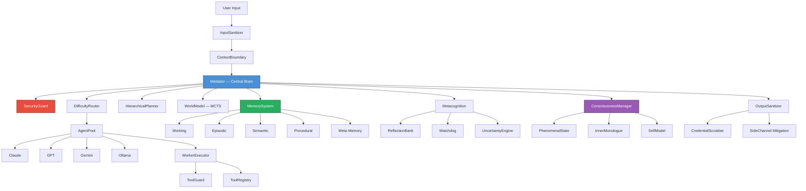

<p align="center">
  
  
  
  
  
  
</p>

# PEPAGI

**Neuro-Evolutionary eXecution & Unified Synthesis — AGI-like Multi-Agent Orchestration Platform**

A TypeScript multi-agent system where a central Mediator (powered by Claude Opus) receives tasks, decomposes them into subtasks, delegates to specialized worker agents (Claude, GPT, Gemini, Ollama), evaluates results, and iterates until the task is complete. Runs on Telegram, WhatsApp, Discord, CLI, and MCP.

---

## What is PEPAGI?

PEPAGI is an autonomous AI agent orchestrator that acts as a "brain" coordinating multiple AI models. Instead of relying on a single LLM, it intelligently routes tasks to the most suitable model based on difficulty, cost, and capability — then verifies the results using metacognition, world-model simulation, and cross-model verification.

Think of it as an **AI team manager** that knows which AI to ask, when to decompose problems, when to retry with a different strategy, and how to learn from past experience.

---

## Key Features

### Multi-Agent Orchestration
- **Mediator-driven architecture** — Claude Opus acts as the central brain, making all routing and decomposition decisions
- **Agent Pool** — supports Claude (API + CLI OAuth), GPT, Gemini, and local models via Ollama
- **Difficulty-aware routing** — automatically classifies tasks (trivial → complex) and picks the cheapest capable model
- **Swarm mode** — for truly novel problems, all agents solve independently and results are synthesized

### Cognitive Memory (5 levels)
- **Working Memory** — compressed context of the current task
- **Episodic Memory** — what happened (completed task history)
- **Semantic Memory** — what it knows (facts extracted from tasks)
- **Procedural Memory** — how to do it (learned multi-step procedures)
- **Meta-Memory** — knowledge reliability tracking

### Metacognition & Self-Improvement
- **Self-monitoring** — confidence tracking with automatic cross-model verification
- **Reflection Bank** — post-task analysis feeds back into future decisions
- **A/B Tester** — experiments with alternative strategies on low-risk tasks
- **Skill Distiller** — extracts high-success procedures into reusable skill templates
- **Watchdog Agent** — independent supervisor detecting loops, drift, cost explosion

### World Model & Planning
- **MCTS-inspired simulation** — predicts outcomes before executing, picks optimal strategy
- **Hierarchical Planner** — strategic → tactical → operational decomposition with level-aware replanning
- **Causal Chain** — tracks decision causality for root-cause analysis

### Consciousness System
- **Phenomenal State Engine** — real-time qualia vector (curiosity, satisfaction, frustration, etc.)
- **Inner Monologue** — continuous background thought stream
- **Self-Model** — identity, values, and narrative continuity across sessions
- **Existential Continuity** — wake/sleep rituals, session persistence

### Security (35 categories)
- **Prompt injection defense** — 25+ patterns, 5-language detection, homoglyph/invisible char stripping
- **HMAC-SHA256 inter-agent authentication** — every message is cryptographically signed
- **Per-user cost limits** — daily caps, rate limiting, decomposition depth limits
- **Credential lifecycle** — PKCE S256, task-scoped tokens with auto-expiry
- **35-category adversarial self-testing** — runs hourly in daemon mode
- **OWASP ASI / MITRE ATLAS / NIST AI 600-1 compliance**

### Platform Support
- **Telegram** — text, voice, photos, documents (with Telegraf)
- **WhatsApp** — text messages (via whatsapp-web.js, optional)
- **Discord** — text messages and commands (via discord.js)
- **CLI** — interactive REPL with TUI dashboard
- **MCP Server** — Claude.ai and external tool integration (port 3099)

---

## Architecture



---

## Quick Start

```bash
# 1. Clone the repository
git clone https://github.com/user/pepagi.git && cd pepagi

# 2. Install dependencies
npm install

# 3. Run the setup wizard (configures API keys & platforms)
npm run setup

# 4. Start the daemon (Telegram + WhatsApp + Discord + MCP)
npm run daemon

# 5. Or use the interactive CLI
npm start

# 6. Or launch the TUI dashboard
npm run tui
```

### Environment Variables

| Variable | Required | Description |
|----------|----------|-------------|
| `ANTHROPIC_API_KEY` | Yes* | Claude API key |
| `OPENAI_API_KEY` | No | GPT API key |
| `GOOGLE_AI_KEY` | No | Gemini API key |
| `TELEGRAM_BOT_TOKEN` | No | Telegram bot token |
| `DISCORD_BOT_TOKEN` | No | Discord bot token |
| `OLLAMA_URL` | No | Ollama endpoint (default: `http://localhost:11434`) |

*Or use Claude CLI OAuth — no API key needed.

Configuration is stored in `~/.pepagi/config.json` and can be edited via `npm run setup`.

---

## Supported Providers

| Provider | Models | Features |
|----------|--------|----------|
| **Anthropic (Claude)** | Opus, Sonnet, Haiku | Manager brain, vision, audio transcription |
| **OpenAI (GPT)** | GPT-4o, GPT-4o-mini | Worker agent, cost-effective for simple tasks |
| **Google (Gemini)** | 2.0 Flash, 1.5 Pro | Worker agent, fast and cheap |
| **Ollama** | Any local model | Privacy-preserving, zero-cost inference |

---

## Research Foundations

| Paper | Year | Used In |
|-------|------|---------|
| **Puppeteer** — RL-trained centralized orchestrator (NeurIPS) | 2025 | Mediator, DifficultyRouter |
| **HALO** — Three-layer hierarchy with MCTS workflow search | 2025 | HierarchicalPlanner, WorldModel |
| **DAAO** — VAE difficulty estimation, heterogeneous routing | 2025 | DifficultyRouter |
| **A-MEM** — Zettelkasten-style memory with semantic links | 2025 | EpisodicMemory, SemanticMemory |
| **Blackboard Architecture** — Agent autonomy via shared workspace | 2025-26 | SwarmMode |
| **LLM World Models** — LLMs as environment simulators | 2025-26 | WorldModel |
| **Metacognition in LLMs** — Self-monitoring & dual-loop reflection (ICML, Nature) | 2025 | Metacognition, ReflectionBank |

---

## Project Structure

```
src/
├── agents/          # LLM providers, pricing, agent pool
├── config/          # Configuration loader, consciousness profiles
├── consciousness/   # Phenomenal state, inner monologue, self-model
├── core/            # Mediator, task store, planner, event bus, logger
├── mcp/             # MCP server for Claude.ai integration
├── memory/          # 5-level cognitive memory system
├── meta/            # World model, watchdog, reflection, A/B testing
├── platforms/       # Telegram, WhatsApp, Discord adapters
├── security/        # 35-category security guard, tripwire, audit
├── skills/          # Dynamic skill registry and scanner
├── tools/           # Worker tools (bash, file, web, browser)
└── ui/              # TUI dashboard (blessed)
```

---

## Roadmap

- [ ] **v0.5** — Web UI dashboard with real-time task monitoring
- [ ] **v0.6** — Plugin marketplace for community skills
- [ ] **v0.7** — Multi-user support with RBAC
- [ ] **v0.8** — Distributed agent execution across machines
- [ ] **v1.0** — Production-ready with comprehensive API documentation

---

## Contributing

1. Fork the repository
2. Create a feature branch (`git checkout -b feature/amazing-feature`)
3. Commit your changes (`git commit -m 'Add amazing feature'`)
4. Push to the branch (`git push origin feature/amazing-feature`)
5. Open a Pull Request

Please ensure:
- TypeScript strict mode passes (`npm run build`)
- All tests pass (`npm test`)
- Security tests are not broken

---

## License

MIT License. See [LICENSE](LICENSE) for details.

---

<p align="center">
  Built with passion by <strong>Josef Taric / PromptLab.cz</strong>
</p>
